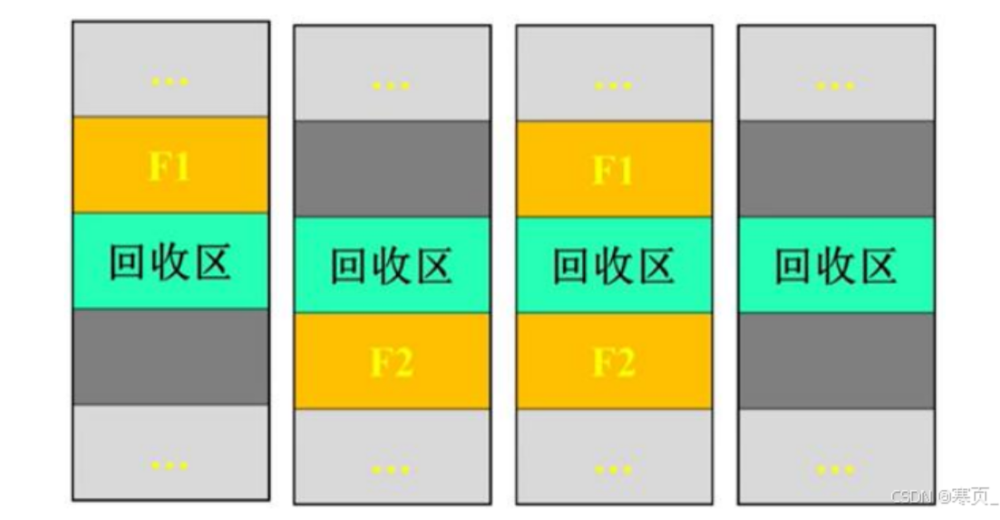

# 五、存储器管理

## 5.1 存储器的层次结构

CPU寄存器： 寄存器

主存： 高速缓存、主存储器、磁盘缓存

辅存： 固定硬盘、可移动介质（二级存储）

层次越高，速度快 空间小 价格贵

高速缓存：备份主存常用数据   磁盘缓存：暂存部分磁盘常用信息

## 5.2 程序的装入和链接

#### 程序运行步骤

编译 - 链接 - 装入

#### 地址

物理地址（绝对地址）

逻辑地址（虚拟地址、相对地址）

#### 内存保护

目的：保证OS不被用户访问，保护用户进程不会相互影响

实现：硬件

### 程序装入方式

绝对装入方式

可重定位装入方式

动态运行时装入方式

### 程序的动态链接

## 5.3 对换与覆盖

**对换与覆盖的功能（对换/交换：提高内存利用率，覆盖：解决程序大于内存的问题）**

### 对换

#### 对换概念

把内存中暂时不能运行的进程或者暂时不用的程序和数据，调出到外存上，以便腾出足够的内存空间，再把已具备运行条件的进程或进程所需的程序或数据，调入内存。

#### 对换功能

对换是提高内存利用率的有效措施，广泛应用于OS中

#### 对换类型

整体对换（进程对换）

页面（分段）对换

#### 对换区的管理

对换区管理的主要目标

>提高进程换入和换出的速度
>提高文件存储空间的利用率次之
>应采用连续分配方式,很少考虑碎片问题

盘块管理中的数据结构
>用于记录外存对换区中的空闲盘块的使用情况
>与动态分区分配方式相似
>空闲分区表/空闲分区链:包含对换区首址及大小

对换区的分配与回收

>与动态分区方式的内存分配与回收方法相似

### 覆盖

解决问题：程序大小超过物理内存总和

程序执行时:
只在内存中保留那些在任何时间都需要的指令和数据;
程序的不同部分在内存中相互替换。

由程序员声明覆盖结构，不需要操作系统的特别支持

覆盖结构的程序设计很复杂，常应用于早期的操作系统，现在多用对换

### 覆盖与对换技术的区别
覆盖直接盖没，旧数据丢失，可减少一个进程运行所需的空间。对换可让整个进程暂存于外存中，让出内存空间。
覆盖是由程序员实现的，操作系统根据程序员提供的覆盖结构来完成程序段之间的覆盖。对换技术不要求程序员给出覆盖结构。
覆盖技术主要在同一个作业或进程中进行。对换主要在作业或进程之间进行。

## 5.4 连续分配的存储管理方式

连续分配方式：为一个用户程序分配一个连续的内存空间

### 单一连续分配

单道程序环境，内存利用率低

### 固定分区分配

预先将可分配的主存储器空间分成若干个连续区域，每个连续区域称为一个分区

### 动态分区分配

根据实际需要，动态分配内存空间

#### 数据结构

**空闲分区表**

一个分区有大小，起始地址，状态三个属性，构成一行数据

**空闲分区链**

将空闲分区链接起来，要设置前向指针、后向指针构成双向链

#### 分配算法

顺序式分配算法

索引式分配算法

#### 分配操作

分配内存

回收内存

**内存回收时的四种情况（下图）**

其中，黄色是空闲分区，深灰色是占用区，回收后黄色空闲区扩大（把绿色吃掉），首地址变为新黄色大块左上角位置的地址）

第一、二种情况：黄色块都是一个，不用新增或删除   节点（空闲表中的行数据/链表上的节点）

第三种情况：黄色块少一个，需要删除节点，第四种情况：多出一个黄色块，需要新增节点

### 动态可重定位分区分配

连续分配方式存在的问题

>碎片：不能被利用的小分区
>解决方案：紧凑，要求代码和数据可以在内存中移动（紧凑定义如下）

**紧凑功能和可重定位分区分配的方法和目的**

**通过移动内存中作业的位置，把分散的小分区拼接为大分区，从而减少内存碎片，提高空间利用率**

动态重定位：在指令运行时,实现地址转换(相对地址转换为绝对地址)

分配算法：类似于动态分区分配算法,增加了紧凑的功能

## 5.5 分页存储管理方式

分页存储管理是一种常见的内存管理方式，它将物理内存和逻辑内存都分割成固定大小的页面（Page），并将程序和数据划分为相同大小的页面块进行存储

1. **页面（Page）：** 内存被划分为大小相等的固定页面。每个页面的大小通常为2的幂（如4KB、8KB）。页面是内存分配和访问的基本单位。页面是**逻辑**上划分的内存单位，用于管理逻辑地址空间。**物理块**是**物理内存**的实际单位。
2. **页表 - 逻辑地址空间与物理地址空间的映射：** 程序使用的是逻辑地址（或虚拟地址）空间，而实际在内存中进行存储和访问的是物理地址空间。通过页表（Page Table）来实现逻辑地址到物理地址的映射。页表记录了逻辑页面号与物理页面号之间的对应关系。
3. **分页过程：** 当程序需要加载到内存执行时，操作系统将程序和数据按照页面大小进行划分，每个页面分配一个唯一的逻辑**页面号**（Logical Page Number）。这样，程序的逻辑地址空间就被划分为多个逻辑页面。
4. **页面置换（Page Replacement）：** 当物理内存不足以容纳所有需要执行的页面时，操作系统通过页面置换算法选择一个页面替换出去，将新的页面调入内存。常见的页面置换算法有最佳(Optimal)、先进先出(FIFO)、最近最少使用(LRU)等。
5. **页表：** 页表是用于管理逻辑地址到物理地址映射的数据结构。页表中的每一项有 **逻辑页号**$\rightarrow$**物理块号** 的映射。是页表的子集？类似dp高速缓存（并行查找而不是按顺序查找），能快速根据页号查出物理块号。
6. **页面大小的选择：** 页面大小的选择需要权衡多个因素。较小的页面可以更有效地利用内存，但会增加页表的大小和访问开销；较大的页面可以减少页表的大小和访问开销，但会增加碎片化问题。
6. **地址结构**：页号+偏移量，类似书中第几页第几行，计算就是相除后拿到商和余数作为页码和偏移量，是个人都会算！

## 5.6 分段存储管理方式

分段存储管理是一种内存管理方式，它将程序和数据划分为不同的段（Segment），每个段具有不同的逻辑意义和长度。

1. **段（Segment）：** 程序和数据被划分成不同的段，每个段代表了具有相同逻辑意义的一块连续地址空间。比如，一个程序可以被划分为代码段、数据段、堆段和栈段等。
2. **段表（Segment Table）：** 分段存储管理使用段表来管理逻辑地址到物理地址的映射关系。段表中的每一项记录了段号和对应的物理地址起始位置以及段的长度。
3. **逻辑地址空间与物理地址空间的映射：** 程序使用的是逻辑地址（或虚拟地址）空间，而实际在内存中进行存储和访问的是物理地址空间。通过段表来实现逻辑地址到物理地址的映射。
4. **段装入（Segment Loading）：** 当程序需要加载到内存执行时，操作系统将每个段按照其长度和逻辑地址的要求装入到内存的不同位置。
5. **段保护（Segment Protection）：** 段表中可以设置保护位来控制对各个段的访问权限。这样可以实现不同段之间的隔离和保护，保护重要数据和代码的安全性。
6. **外部碎片问题：** 分段存储管理方式可能会导致外部碎片问题，即由于段的长度不同，留下一些不连续的内存空间无法被利用，从而浪费了一部分内存。

**分页/分段存储时，逻辑地址与物理地址之间的转换计算**

**分页**

因为页的大小和物理块的大小通常是一样的，所以页内地址=块内地址

逻辑地址分为页号+偏移量（页内地址），然后页号根据页表查出对应块号，块号+偏移量直接就是物理地址！easy~

**分段**

和页不同，一个段的大小不是固定的，而且位置是离散的
所以段表中记录是是该段的起始地址（基地址），大小不固定所以要有长度属性

逻辑地址分为段号+偏移量（段内地址），然后段号根据段表查出基地址，基地址+偏移量直接就是物理地址！easy too~

注意：由于多出长度属性，因此不仅可能段号过大会发生越界中断，**段内地址 > 段的长度也会发送越界中断！**
所以叫**二维表**，其实就是多了一列：页表一列（一维），段表两列（二维）

### GPT

#### 分页存储管理方式下的逻辑地址到物理地址转换计算：

1. **逻辑地址结构：** 逻辑地址通常由两部分组成，一部分是页号（Page Number），另一部分是页内偏移量（Offset）。

   逻辑地址 = 页号 + 页内偏移量

2. **物理地址结构：** 物理地址同样由两部分组成，一部分是帧号（Frame Number），另一部分是页内偏移量（Offset）。

   物理地址 = 帧号 + 页内偏移量

3. **逻辑地址到物理地址的转换过程：** 通过页表（Page Table）来实现逻辑地址到物理地址的映射。

   - 首先从逻辑地址中提取出页号。
   - 然后根据页号查找对应的页表项，获取对应的帧号。
   - 最后将帧号和页内偏移量合并得到物理地址。

#### 分段存储管理方式下的逻辑地址到物理地址转换计算：

1. **逻辑地址结构：** 逻辑地址由两部分组成，一部分是段号（Segment Number），另一部分是段内偏移量（Offset）。

   逻辑地址 = 段号 + 段内偏移量

2. **物理地址结构：** 物理地址同样由两部分组成，一部分是段号（对应于段在物理内存中的位置），另一部分是段内偏移量。

   物理地址 = 段号 + 段内偏移量

3. **逻辑地址到物理地址的转换过程：** 通过段表（Segment Table）来实现逻辑地址到物理地址的映射。

   - 首先从逻辑地址中提取出段号。
   - 然后根据段号查找对应的段表项，获取对应的物理地址起始位置。
   - 最后将物理地址起始位置和段内偏移量相加得到物理地址。

**分页存储和分段存储的区别**

|  | 分页 |  分段 |
| -- | -- | --|
| 信息单位 | 页 | 段| 
| 信息完整性| 离散分配方式 | 意义相对完整| 
| 页/段的大小 | 固定，由系统决定 | 不固定，由程序员决定| 
| 地址空间 | 一维 | 二维 |

## 5.7 段页式存储管理方式

分页分段原理的结合
