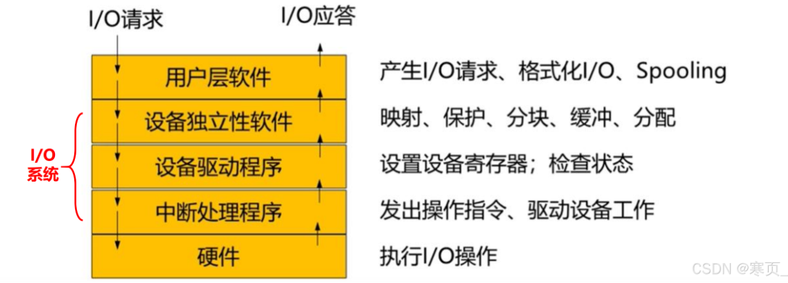

# 7、IO系统

## 7.1 IO系统的功能、模型和接口

### I/O系统管理的主要对象

> I/O设备和对应的设备控制器

### I/O系统的主要任务

>完成用户提出的I/O请求
>提高I/O速率
>改善I/O设备的利用率

### I/O系统的基本功能

>能够隐藏物理设备的细节
>能够保证OS与设备无关
>能够提高处理机和I/O设备的利用率
>能够对I/O设备进行控制
>能够确保对设备的正确共享
>能够处理错误

### 模型层次结构

### 接口

**块设备接口**

1）该设备的基本特征是传输速率较高，通常为每秒几十MB到几百MB

2）可寻址，即能指定数据的输入源地址以及输出的目标地址

**流设备接口**

1）字符设备的基本特征是传输速率较低，通常为每秒几B至数千B 

2）另一特征是不可寻址，即不能指定数据的输入源地址以及输出的目标地址

**网络接口**

使计算机能通过网络进行互通信

## 7.2 IO设备和设备控制器

### IO设备4种分类方式

**1、按使用特性分类**

存储设备、IO设备

**2、按传输速率分配**

低速设备：键盘、鼠标、语音输入输出 ...

中速设备：行式打印机、激光打印机 ...

高速设备：磁带机、磁盘机、光盘机 ...

**3、按信息交换单位分类**

块设备、字符设备

**4、按设备共享特性分类**

独占设备、共享设备

### 接口

$$设备 \stackrel{接口}{\longrightarrow} 设备控制器\stackrel{其他}{\longrightarrow}CPU$$

**在接口中有三类信号对应三条信号线**

数据信号线、状态信号线、控制信号线

### 设备控制器

#### 概念

设备控制器是CPU与I/O设备之间的接口，接收从CPU发来的命令，并去控制I/O设备工作

#### 主要功能

控制一个或多个I/O设备，以实现I/O设备和计算机之间的数据交换

#### 基本功能

接收识别命令，数据交换，表示和报告设备的状态，地址识别，数据缓冲区，差错控制

#### 组成

设备控制器与CPU处理机的接口

设备控制器与IO设备的接口

IO逻辑

### 内存映像

没有内存映像的话，访问内存和设备需要两种不同的指令

统一编址k，根据编址k的取值区分是内存地址（1-n）还是寄存器地址（>n） 

### IO通道

使一些原来由CPU处理的I/O任务转由通道来承担，减小CPU压力

说人话：IO通道就是特殊的处理机（CPU是中央处理机），用来帮CPU分担相关IO操作的，而且IO通道还是一个IO控制器

优缺点：CPU和IO设备可以并行，但实现复杂，需要硬件支持

**通道类型**

字节多路、数组选择、数组多路、非分配型子通道

#### 单通路IO系统

一设备对应一通路到CPU，树形结构无重用，效率低

#### 多通路IO系统

一设备对应多通路到CPU，有重用，效率高

## 7.3 中断和中断处理程序

### 中断

#### 中断和陷入

中断是CPU对IO设备发来的中断信号的一种响应

陷入是CPU内部事件引起的中断

#### 中断向量表

记录中断号，中断程序的入口地址

#### 中断分类

嵌套中断

屏蔽中断（禁止中断，当前中断执行完再说）

## 7.4 设备驱动程序

主要任务是接收上层软件发来的抽象I/O要求，把它们转换为具体要求后发送给设备控制器， 进而使其启动设备去执行任务
反之，它也会将设备控制器发来的信号传送给上层软件

> 比如键盘驱动程序，将按键IO请求转为具体要求发给设备控制器，然后可能经过IO通道发送中断给CPU，也可能直接通过主机总线

### 设备驱动程序的功能 

① 接收由与设备无关的软件发来的命令和参数； 

② 检查用户I/O请求的合法性； 

③ 发出I/O命令。 

④ 此外，也及时响应由设备控制器发来的中断请求。

### 设备驱动程序的特点

① 实现在与设备无关的软件和设备控制器之间通信和转换的程序；

② 与设备控制器以及I/O设备的硬件特性紧密相关； 

③ 与I/O设备所采用的I/O控制方式紧密相关

### 设备处理方式 

不同操作系统采取的设备处理方式不同，通常可分成3类： 

① 为每类设备设置一个进程，专门用于执行这类设备的I/O操作； 

② 在整个系统中设置一个I/O进程，专门用于执行系统中各类设备的I/O操作； 

③ 不设置专门的设备处理进程，而只**为各类设备设置相应的设备驱动程序**（使用较多）。

### IO设备的控制方式

**1、轮询**

CPU来问，一直忙就一直轮流问

**2、中断**

CPU给你指令，让你去读写，你跟CPU说OK（中断方式），让他将你这个IO进程堵塞，去进行其他计算等操作

等你读写完了，你要回来告诉CPU，给他个中断让他回来继续处理你原来IO进程的代码

可以并行，但每个读写只有一个字节，还是太慢

**3、直接存储器访问（DMA）方式**

设备和内存直接双向连接，不需要中间CPU来干预（除非多个数据块刚开始发送或结束时才干预）

**4、IO通道控制方式**

是DMA的扩展，设备和内存直接双向连接的基础上，**干预由IO通道来完成而不是CPU！**

当CPU要完成一组相关操作时，只需向I/O通道发送一条I/O指令，通道接到指令后，通 过执行通道指令完成CPU制定的I/O任务

## 7.5 与设备无关的IO软件

当应用进程运行时，如果所请求的物理设备 （独占设备类型）已分配给其他进程，而此时尽管还有几台其他的相同设备空闲可用， 但系统只能根据设备的物理名来进行分配

比如有几台打印机，明明有几台空闲的，但系统非要等那个忙碌的，名字对的打印机...

那就别命名，抽象！直接逻辑设备名，可用于IO重定向

逻辑和物理设备映射就搞张表（逻辑设备表LUT），基操了属于是...

分配设备需要用到如：FCFS 等算法

## 7.6 用户层的IO软件

大部分I/O软件都放在OS内部，仍有一小部分在用户层

用户程序需要利用库函数这类API实现对内核态的访问，进行系统调用

### 外围机

脱机情况下，CPU从磁带上加载数据进行计算

### 假脱机

外围操作与CPU对数据的处理同时进行，这种在联机情况下实现的同时外围操作称为**假脱机技术（SPOOLing）**

1、使用**输入进程、输出进程**来模拟外围机

- 输入进程：低速IO设备数据存到高速磁盘上

- 输出进程：高速磁盘上的数据传到低速输出设备

2、**输入井、输出井**用来模拟脱机时的磁盘

3、**输入缓冲区、输出缓冲区**用来调和CPU和磁盘速度不匹配的矛盾

#### 假脱机打印机

打印机是独占设备，但利用假脱机技术可以让打印任务都加到输出井队列里，然后有打印设备就进行打印操作，实现设备的虚拟化

**假脱机SPOOLing系统的组成和功能**

**组成包括：I/O井、I/O缓冲区、I/O进程、井管理进程**

**功能：提高I/O速率、 对独占设备实现共享，实现了虚拟设备功能**

## 7.7 缓冲区管理

**引入缓冲区的主要原因**

**缓和CPU和I/O设备间速度不匹配的矛盾，提高CPU和I/O设备的并行性**

## 7.8 磁盘性能概述和磁盘调度

**磁盘访问时间的计算**

**寻道时间、旋转延迟时间、传输时间**

1、寻道时间 Ts 一般题目会给

2、旋转延迟时间 就是找到道之后，在这一圈等待正确位置所需的时间，平均下来是半圈，所以时间 = 旋转半圈所需时间

3、传输时间 Tt = 传输总数据 / 传输速率 = b(字节数) / v = 传输总数据 / (转速*一条磁道上的字节数)  = b / rN

> 比如一秒2转，一转就读取一条磁道上的字节数，那么一秒就读取 2*一条磁道上的字节数，即rN

存储容量 = （磁盘总面个数-2）* 道数 * 一个道的容量：周长*位密度

要使磁盘访问时间最短，需要让**寻道时间（圆内外方向）尽可能最短**，需要通过磁盘调度算法来进行调度

为什么是寻道时间？因为你在一条道上磁头不动，一直靠着盘的自转读取数据啊，这部分读取时间改变不了的(转速摆在那里)

那要切换道来读取其他进程数据，那不就得寻道？得在圆心-圆边缘方向移动找到最适合的道啊！

**磁盘调度算法的应用**

**先来先服务FCFS、最短寻道优先SSTF、扫描/电梯调度算法SCAN、循环扫描算法CSCAN**

- 先来先服务，字面意思（时间优先）

- 最短寻道，看看下次哪个离现在距离最短，就往那边移动（距离优先）

- 扫描/电梯调度算法：防止某个进程明明先来，但是一直没距离最优而导致饥饿

  这种算法需要先向一边移动，然后到起点后反转方向回来扫描（来回扫描）

- 循环扫描：在电梯的基础上不反转方向，反正都是一个圆，继续转就完了！
