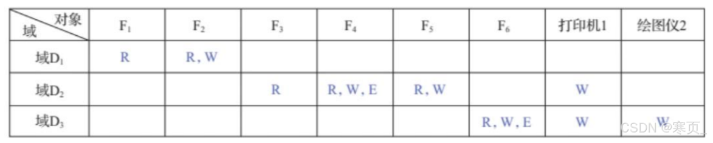

# 8、文件管理

## 8.1 文件和文件系统

简单，目录就是文件夹，然后按 `磁盘-文件夹-文件` 3层次存储

## 8.2 文件的逻辑结构

**文件的结构**

**逻辑结构：从用户的角度来看，文件的逻辑记录是能够被存取的基本单位。**

**物理结构：从物理存储角度来看，指文件在外存上的存储组织形式。**

**按记录方式对文件进行的三种分类方法及其特点**

**顺序文件、索引文件、索引顺序文件**

顺序文件按顺序

索引文件按索引表的记录

索引顺序文件，外层索引表记录组的起始地址，内存顺序查找记录

> 索引顺序文件还可以建立多层索引，最后一层块再按顺序存储

## 8.3 文件目录

**文件目录的存放位置**

**目录也是文件，其存放在外存当中**

### 文件控制块和索引节点

### 目录结构

#### 单极文件目录

不允许重名

#### 两级文件目录

多用户隔离，但不利于文件共享

#### 树形结构目录

正常理解的

#### 无环图目录

假设允许一个文件可以有多个父目 录，即有多个属于不同用户的目录 同时指向同一个文件

### 目录查询技术

线性检索法

## 8.4 文件共享

**两种实现文件共享的两种方式及其区别**

**索引节点、符号链接**

1．利用索引节点解决文件共享问题

文件的物理地址及其他文件属性等信息不再放入目录项中，而是放在索引节点中

2．利用符号链接实现文件共享

## 8.5 文件保护

### 影响文件安全性的主要因素

人为因素（有意或无意的行为）

系统因素（系统出现异常造成数据的破坏或丢失） 

自然因素（随着时间的推移，存放在磁盘上的数据会逐渐消失）

### 采取的措施

**存储控制机制**（防止人为因素导致文件不安全） 

系统容错技术（防止系统某部分的故障导致文件不安全） 

建立后备系统（防止自然因素导致文件不安全）

### 保护域

**访问权**    进程对于对象的访问权力(读、写 等)的集合         `(对象名，权集)`     `(F(进程)，{R/W})`

**保护域**    进程对一组对象访问权的集合，包含多个 `(F(进程)，{R/W})`

进程和域一对一：静态；   一对多：动态联系方式

**访问矩阵**

掌握 **访问控制表ACL** 和 **访问权限表**

