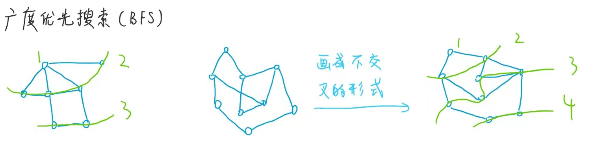
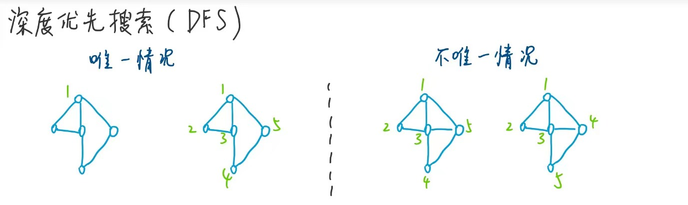
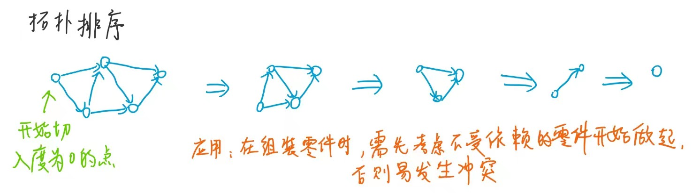
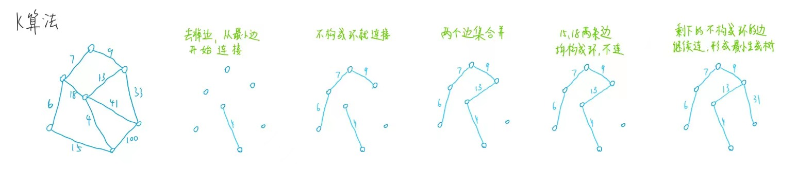
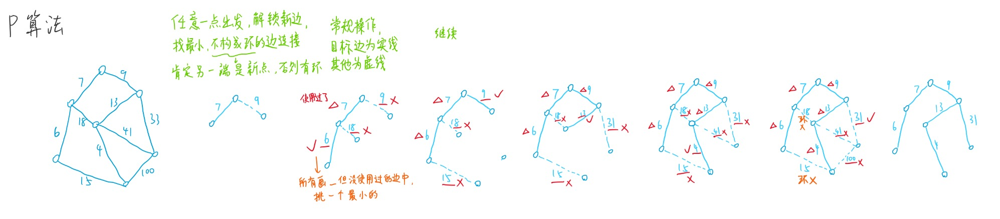
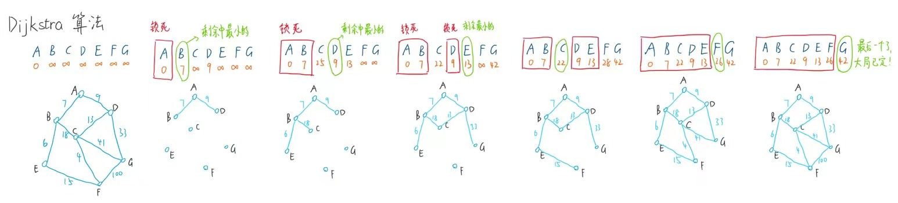

### 图的存储方式
#### 邻接表 (有向图+无向图)
一张表，每一行写上：
```
[from,  to1,      to2,      to3 ...]   表示一个节点是所有直接邻居
       weight1  weight2   weight3        以及到各个邻居的距离
```
可以用数组+链表来实现
```C++
class Node{
    int value;
    Node* next;
    Node(int v){
      this->value = v;
    }
}
[Node1(from_A) -> Node2(to) -> Node3(to) -> Node4(to),
Node1(from_B) -> Node2(to) -> Node3(to) -> Node4(to)]
// 一维数组，每个元素都是链表，链表里面的fromx连接着多个x的邻居，每个邻居存储着权重value
```
#### 邻接矩阵 (有向图+无向图)
节点分别按行和列写，比如最左列是from，最上行是to，中间的一个个方格写权重weight(无向图的话，矩阵数据是满的)  
```
weight(w)      ∞(表示没有直接相邻)
      A     B     C     D
A     w     w     w     ∞
B     ∞     w     w     w
C     w     w     ∞     ∞
D     ∞     ∞     w     w
```
#### 数组
简单的情况下，可以直接使用数组 (比如简单无环图)
**简单哈希表的键值可以用数组(索引/值)代替，寻址更快！**
### 模板图
将各种形式的图转化为一个图的模板，之后的算法都是基于这个模板来使用的，所以我们用转化，而不是根据不同的复杂结构写出不同算法  
```C++
class Node {
public:
    int value;            // 点的值
    int in;               // 入度 
    int out;              // 出度
    vector<Node*> nexts;  // 相邻点集
    vector<Edge*> edges;  // 相邻边集
    Node(int value) {
        this->value = value;
        in = 0;  
        out = 0;       
    }
};
class Edge {
public:
    int weight;
    Node* from;   // 从from点到to点，权重/距离为weight
    Node* to;
    Edge(int weight, Node* from, Node* to) {
        this->weight = weight;
        this->from = from;
        this->to = to;
    }
};
class Graph {
public:        // 所有点+所有边
    unordered_map<int, Node*> nodes;
    unordered_set<Edge*> edges;
    Graph() {}
};
```
**举例**
用户给我这些数据
```
[ [weight1, from1, to1]
  [weight2, from2, to2]
  ...
  [weightN, fromN, toN] ]
```
我利用以下**接口函数**进行转换，生成我的模板Graph
```C++
Graph createGraph(vector<vector<int>>& matrix) {
    Graph graph;
    for (int i = 0; i < matrix.size(); i++) {
        int weight = matrix[i][0];
        int from = matrix[i][1];
        int to = matrix[i][2];
        // 表示迭代器遍历到end()还没find找到，那就是没有！要新建点到图里！
        if (graph.nodes.find(from) == graph.nodes.end()) {
            graph.nodes[from] = new Node(from);
        }
        if (graph.nodes.find(to) == graph.nodes.end()) {
            graph.nodes[to] = new Node(to);
        }
        // 图中已有from、to两个点，要新建边到图中、更新in/out和nodes的next
        Node* fromNode = graph.nodes[from];
        Node* toNode = graph.nodes[to];
        Edge* newEdge = new Edge(weight, fromNode, toNode);
        fromNode->nexts.push_back(toNode);
        fromNode->out++;
        toNode->in++;
        fromNode->edges.push_back(newEdge);
        graph.edges.insert(newEdge);
    }
    return graph;
}
// tips: 无向图就不填边，也能用这个模板
```
### 宽度优先遍历(BFS)
类似树，某一个节点遍历后，遍历与之相邻的**所有**节点作为第二层，再遍历与第二次所有节点相邻的点作为第三层（不包括第一层的根节点）...  


```C++
void BFS(Node* node) {
    if (node == nullptr)   return;
    queue<Node*> q;
    unordered_set<Node*> visited;
    q.push(node);
    visited.insert(node);
    while (!q.empty()) {
        Node* cur = q.front();
        q.pop();
        cout << cur->value << endl;     // 打印行为可以换成其他处理行为
        for (Node* next : cur->nexts) {
            if (visited.find(next) == visited.end()) {  // 还没visit(防止往上一层找邻居)
                visited.insert(next);   // 加入当前cur->next的所有节点
                q.push(next);
            }
        }
    }
}
```
### 深度优先遍历(DFS)
类似树，某一个节点遍历后，遍历与之相邻的**一个**节点作为第二层，然后直接break，去找该节点的第三层，其他过程类似树的深度优先遍历...  


```C++
void dfs(Node* node) {
    if (node == nullptr)   return;    
    stack<Node*> stack;
    unordered_set<Node*> visited;
    stack.push(node);
    visited.insert(node);
    cout << node->value << endl;
    while (!stack.empty()) {
        Node* cur = stack.top();
        stack.pop();
        for (Node* next : cur->nexts) {
            if (visited.find(next) == visited.end()) {
                stack.push(cur);
                stack.push(next);  // 这条路一直走，其他不管
                visited.insert(next);
                cout << next->value << endl;
                break;   // break，不走宽度走深度
            }
        }
    }
}
```
### 拓扑排序
有向无环图，由一个入度为0的节点开始，排除掉它，以及它的所有影响，之后再找其他入度为0的点  


```C++
vector<Node*> sortedTopology(Graph& graph) {
    // key: 某一个node   value: 剩余的入度
    unordered_map<Node*, int> inMap;
    queue<Node*> zeroInQueue;
    // 初始化入度表和零入度队列
    for (auto& entry : graph.nodes) {
        Node* node = entry.second;
        inMap[node] = node->in;
        if (node->in == 0) {
            zeroInQueue.push(node);  // 入度为0进队列
        }
    }  // 上面循环干了两件事：inMap加载好所有节点，第一批入度为0的点进队列
    vector<Node*> result;
    while (!zeroInQueue.empty()) {
        Node* cur = zeroInQueue.front();
        zeroInQueue.pop();
        result.push_back(cur);
        for (Node* next : cur->nexts) {
            inMap[next] -= 1;      // 相邻节点入度都-1
            if (inMap[next] == 0) {
                zeroInQueue.push(next);  // 发现新入度为0的点，加入队尾
            }
        }
    }
    return result;
}
```
### 最小生成树
省流：要让连通图减少/不减边后保持连通，但所需的所有边的权重和最小    
一般指带权图(所有点都连通的连通图)的最小生成树，指原图中边的权值(weight/大概理解为长度)最小的生成树  


#### K算法(Kruskal)    ---要求无向图---

开始时，每个点都认为是独立无边的，然后从权重最小的边开始依次连接  
如果连完两个节点后，不构成环，那么加上这条边，这两个节点的集合合并  （环的判断方法：两个点原来在不在同个集合里)
直到所有点都连通起来为止  
**麻烦点** 存在局部连通后，需要整体进行合并的情况，比如上上图的最右侧蓝色部分

以下三个方法都有**mySet、isSameSet、union**三步
1.自己模拟的并查集结构，更好理解
```C++
class MySets {
public:
    unordered_map<Node*, vector<Node*>> setMap;  // 拿到一个点所对应的点集
    MySets(const vector<Node*>& nodes) {
        for (Node* cur : nodes) {
            vector<Node*> set;
            set.push_back(cur);      // 刚开始每个点都自成一个点集
            setMap[cur] = set;
        }
    }
    bool isSameSet(Node* from, Node* to) {
        vector<Node*>& fromSet = setMap[from];
        vector<Node*>& toSet = setMap[to];
        return &fromSet == &toSet;   // 看两个点所在的点集，地址是否相同
    }
    void unionSets(Node* from, Node* to) {
        vector<Node*>& fromSet = setMap[from];
        vector<Node*>& toSet = setMap[to];
        for (Node* toNode : toSet) {
            fromSet.push_back(toNode);  // 两点连通，集合合并在fromSet里
            setMap[toNode] = fromSet;   // 普通相连没有考虑树高，简单粗暴
        }
    }
};
```
##### 并查集
2.下面的并查集结构更难，但遍历的时间复杂度是常数级别
```C++
class EdgeComparator {
public:
    bool operator()(const Edge& e1, const Edge& e2) {
        return e1.weight > e2.weight;
    }
};
class UnionFind {
private:
    unordered_map<Node*, Node*> parent;
    Node* find(Node* node) {   // 寻找根节点并返回
        if (parent[node] != node) {  // 根节点的parent是自己
            parent[node] = find(parent[node]);
        }
        return parent[node];  
    }
public:
    void makeSet(const unordered_map<int, Node*>& nodes) {
        for (const auto& entry : nodes) {
            Node* node = entry.second;
            parent[node] = node;
        }
    }
    void unionSets(Node* node1, Node* node2) {
        Node* root1 = find(node1);
        Node* root2 = find(node2);
        if (root1 != root2) {       // 两节点祖先不一样，祖先root合并
            parent[root1] = root2;  // roo1的parent为root2
        }
    }
    bool isSameSet(Node* node1, Node* node2) {
        return find(node1) == find(node2);  // 根节点要一样，才在同个集合里
    }
};
```
3.带权重的并查集
```C++
class UnionFind {
private:
    unordered_map<Node*, Node*> fatherMap;
    unordered_map<Node*, int> sizeMap;
    Node* findFather(Node* n) {
        Node* father = fatherMap[n];
        if (father != n) {    // father不是自身就能继续往上找
            father = findFather(father);
        }
        fatherMap[n] = father;
        return father;
    }
public:
    UnionFind() {}
    void makeSet(vector<Node*>& nodes) {
        fatherMap.clear();
        sizeMap.clear();
        // 刚开始，每个节点都是一个集合，father是自己，树的节点数size=1
        for (auto node : nodes) {
            fatherMap[node] = node;
            sizeMap[node] = 1;
        }
    }
    bool isSameSet(Node* a, Node* b) {
        return findFather(a) == findFather(b);
    }
    void unionSets(Node* a, Node* b) {
        if (a == nullptr || b == nullptr) {
            return;
        }
        Node* aFather = findFather(a);
        Node* bFather = findFather(b);
        if (aFather != bFather) {
            int aFsize = sizeMap[aFather];
            int bFsize = sizeMap[bFather];
            if (aFsize <= bFsize) {     // 树规模小的，其根的parent指向树规模大的root
                fatherMap[aFather] = bFather;
                sizeMap[bFather] = aFsize + bFsize;  // 记录该根节点下，树的节点个数
            } else {
                fatherMap[bFather] = aFather;
                sizeMap[aFather] = aFsize + bFsize;
            }
        }
    }
};
```
4.哈希表+压缩层数到两层
```C++
template<typename V>
class Element {
public:
    V value;
    Element(V value) : value(value) {} // 初始化列表，可以直接初始化而不用在函数体内逐个赋值，提高代码效率
};
template<typename V>
class UnionFindSet {
public:
    unordered_map<V, Element<V>*> elementMap;
    unordered_map<Element<V>*, Element<V>*> fatherMap;
    unordered_map<Element<V>*, int> sizeMap;
    // 1.初始化，每个元素包在集合里，size = 1
    UnionFindSet(vector<V>& list) {
        for (V value : list) {
            Element<V>* element = new Element<V>(value);
            elementMap[value] = element;
            fatherMap[element] = element;
            sizeMap[element] = 1;
        }
    }
    // 2.找到头节点，降低树高到2层
    Element<V>* findHead(Element<V>* element) {
        stack<Element<V>*> path;
        while (element != fatherMap[element]) {
            path.push(element);
            element = fatherMap[element];
        }
        while (!path.empty()) {
            // 找到Head之后，所有该分支的其他节点都指向他，使树高度降为2层！
            fatherMap[path.top()] = element;
            path.pop();
        }
        return element;
    }
    // 3.判断是否为同个集合
    bool isSameSet(V a, V b) {
        if (elementMap.count(a) > 0 && elementMap.count(b) > 0) {
            return findHead(elementMap[a]) == findHead(elementMap[b]);
        }
        return false;
    }
    // 4.合并两个集合
    void unionSets(V a, V b) {
        if (elementMap.count(a) > 0 && elementMap.count(b) > 0) {
            Element<V>* aF = findHead(elementMap[a]);   // 2层
            Element<V>* bF = findHead(elementMap[b]);   // 2层
            if (aF != bF) {
                Element<V>* big = sizeMap[aF] >= sizeMap[bF] ? aF : bF;
                Element<V>* small = big == aF ? bF : aF;  // 分出大小
                fatherMap[small] = big;   // 小Head接在大Head的下面，树高变为3层
                sizeMap[big] = sizeMap[aF] + sizeMap[bF];  // 之后要重新合并时，才将树高变回2层
                sizeMap.erase(small);     // 小的释放掉
            }
        }
    }
};
```
K算法
```C++
unordered_set<Edge> kruskalMST(Graph* graph) {
    UnionFind unionFind;
    unionFind.makeSet(graph->nodes);    // 1.对应MySets
    priority_queue<Edge, vector<Edge>, EdgeComparator> priorityQueue;
    for (Edge edge : graph->edges) {
        priorityQueue.push(edge);       // 边升序排序
    }
    unordered_set<Edge> result;         // 边集(防止重算)
    while (!priorityQueue.empty()) {
        Edge edge = priorityQueue.top();
        priorityQueue.pop();
        if (!unionFind.isSameSet(edge.from, edge.to)) {
            result.insert(edge);        // 2.之前不在同个集合里就加上这条边
            unionFind.unionSets(edge.from, edge.to);  // 3.并查集里设置好
        }
    }
    return result;
}
```
#### P算法(Prim)    ---要求无向图---

任意从一个点出发，解锁新边，拿到新的边，选权重最小且不构成环的边，连接并拿到该边的另一个点    
再从拿到的新点出发，解锁新边，再从所有被解锁的新边中，选权重最小且不构成环的边，连接并拿到该边的另一个点...    
**对比K算法** 一个点一个点地找并连接起来，不存在两个不同集合merge的过程  
**所以没必要用K算法的复杂结构，直接用一个哈希表就能解决问题！**

```C++
struct EdgeComparator {
    bool operator()(const Edge& e1, const Edge& e2) {
        return e1.weight > e2.weight;
    }
};
set<Edge> primMST(Graph& graph) {
    priority_queue<Edge, vector<Edge>, EdgeComparator> pq;  // 边升序排序
    unordered_set<Node*> set;   // visited过的点
    set<Edge> result;           // 构成最小生成树的边集
    for (auto& node : graph.nodes) { // 随便选一个点(若是连通图，for循环可不用！)
        if (set.find(node) == set.end()) {  // .first是键 是值
            set.insert(node); // 加进set里
            for (auto& edge : node->edges) {
                pq.push(edge); // 解锁新边加入队列排序
            }
            while (!pq.empty()) {
                Edge edge = pq.top(); // 弹出最小边
                pq.pop();
                Node* toNode = edge.to;
                if (set.find(toNode) == set.end()) { // 考察to点是不是新点
                    set.insert(toNode); // 是新点一定不构成环！少了union过程！
                    result.insert(edge); // 进result边集
                    // 解锁新边
                    for (auto& nextEdge : toNode->edges) {
                        pq.push(nextEdge); // 重复边会放入队列，但不影响结果
                    } // 因为弹出重复边时，并没有解锁新点，会被跳过，增加一点常数时间罢了
                }
            }
        }
    }
    return result;
}
```
### Dijkstra算法    
不能有权值为负数的边，否则不能锁死，到某一时刻可能加了个负值很大的边直接最短路了，锁死没用

规定一个出发点，求出该点到其他点的最短距离各是多少（对于不可达的点默认距离无穷大）  
实现： 初始化到自己为0，到别的点距离正无穷
      自己出发找到最小边，找到的路径比原来小就重写，比较完所有路径后锁死当前点，下一个点为当前点最小边的另一端  
      （感觉其实当前点出发只能找到其他节点的新的最小值，自己的路径已经固定锁死了...)  
      下一个点依次循环上述过程，在这之前要记好出发点连到自己的最短距离
```C++
unordered_map<Node*, int> dijkstra1(Node* head) {
    unordered_map<Node*, int> distanceMap;
    distanceMap[head] = 0;
    unordered_set<Node*> selectedNodes;
    Node* minNode = getMinDistanceAndUnselectedNode(distanceMap, selectedNodes);
    while (minNode != nullptr) {    // 最后所有节点都处理完了/被锁了，退出循环结束任务
        int distance = distanceMap[minNode];
        for (const Edge& edge : minNode->edges) {
            Node* toNode = edge.to;
            if (distanceMap.find(toNode) == distanceMap.end()) {
                distanceMap[toNode] = distance + edge.weight;  // distanceMap要记录
            }else{
            distanceMap[edge.to] = min(distanceMap[toNode], distance + edge.weight);
            }                                                  // distanceMap要更新
        }
        selectedNodes.insert(minNode);   // 处理完了到这个节点的mindistance，把它锁了(selected)！
        minNode = getMinDistanceAndUnselectedNode(distanceMap, selectedNodes);
        // 重新在没被锁的节点中，找到起始点到其距离最短的点
    }
    return distanceMap;   // 把到<各个点,最小距离>的这个map返回
}
// 未锁的，到起始点路径最短的节点（没碰到的节点默认距离正无穷）
Node* getMinDistanceAndUnselectedNode(unordered_map<Node*, int>& distanceMap,
                                      unordered_set<Node*>& touchedNodes) {
    Node* minNode = nullptr;
    int minDistance = numeric_limits<int>::max();
    for (const auto& entry : distanceMap) {
        Node* node = entry.first;
        int distance = entry.second;
        if (touchedNodes.find(node) == touchedNodes.end() && distance < minDistance) {
            minNode = node;             // 不能被锁，距离更小
            minDistance = distance;     // 更新节点及其距离
        }
    }
    return minNode;
}
```
#### 堆的优化
比如Dijkstra算法中，找最小边是通过遍历的方式，那我能不能用堆，给系统一个值，它给我弹出最小边呢？  
不行，因为可能找到其他较短路径而修改其他边的值，导致系统内部(全局扫描的方式)改堆的时候，复杂度跟普通的遍历差不多，没啥卵用  
所以这时候需要自己**手写堆**，自己对heapInsert和heapify进行自定义调整  
Dijkstra2左神有提供，自己懒得看了...