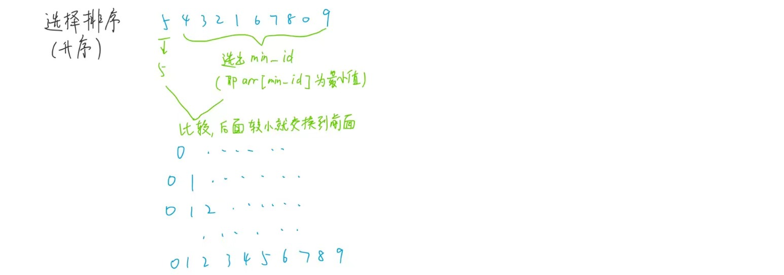
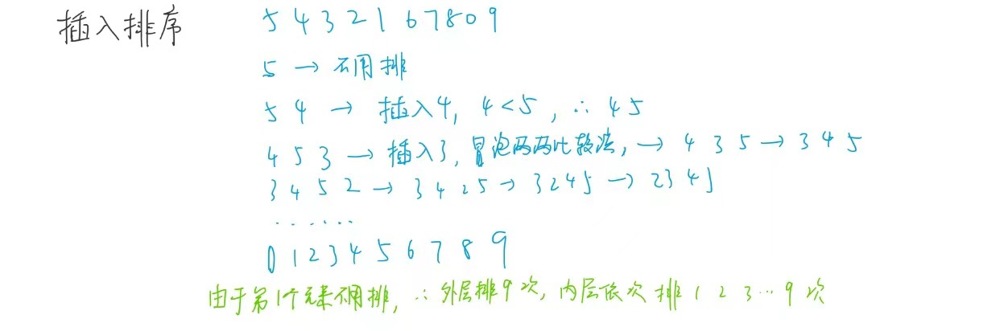
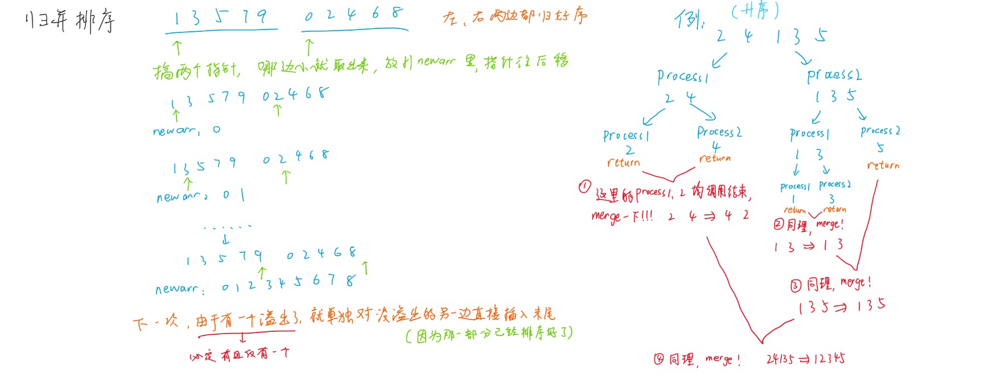
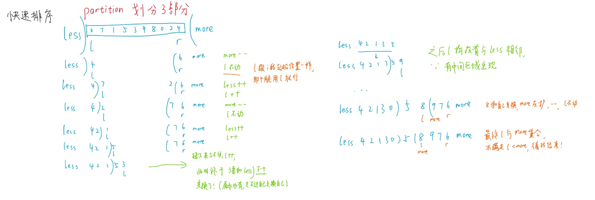
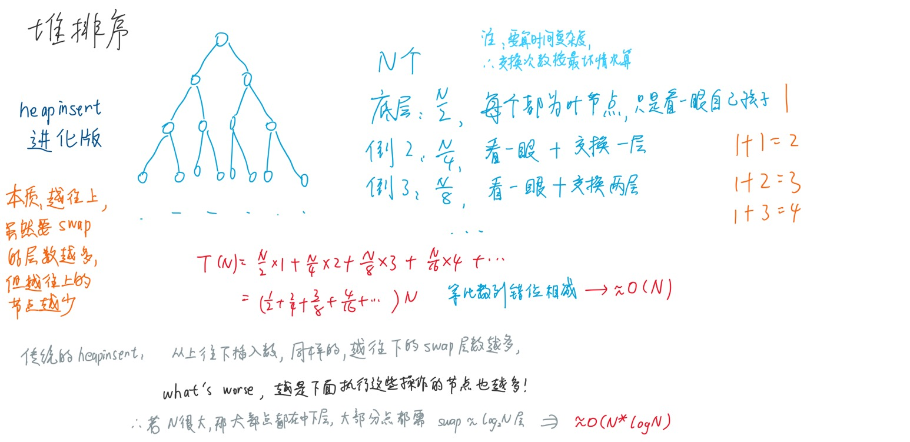
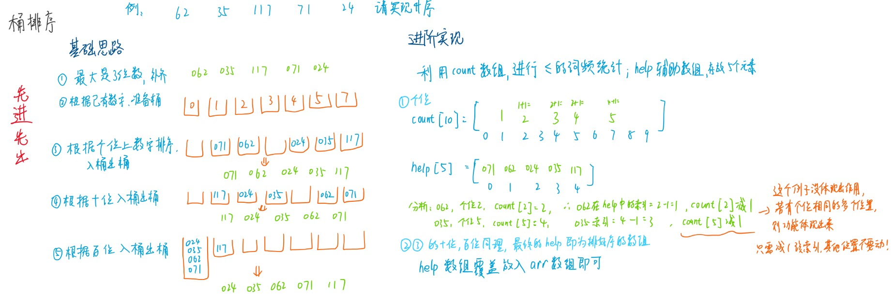

代码理解后，记住就行了，不用老是痛苦回忆为什么！
## 时间复杂度
算法效率高低  
O指代最坏情况下的时间复杂度，最好的Ω和平均的θ复杂度没啥卵用，用户极有可能倒霉(比如我...)，然后算法效率过低的情况  
案例： 冒泡排序     O(n²)  
如果比较不出来，如都是n的平方的级别，那就要实际运行一下代码进行比较！ 

## 空间复杂度
内存空间占用
不止要考虑变量个数，还要考虑变量占据内存字节大小，数组等结构的大小等
##### swap案例：  
普通交换函数：引入tmp进行交换  
利用位运算(异或)交换函数：无需引入新的变量，减少函数空间复杂度  
```C++
"a = 甲   b = 乙"
a=a^b      "a = 甲 ^ 乙      b = 乙"
b=a^b      "a = 甲 ^ 乙      b = 甲 ^ 乙 ^ 乙 = 甲  (b换好了) " 
a=a^b      "a = 甲 ^ 乙 ^ 甲 = 乙  (a换好了)"
```
注意： a,b都要转成二进制的形式，再按每一位进行异或位运算！!
#### 异或运算
##### 题目一：数组中，其他数都出现偶数次，只有一个数出现奇数次，要把它找出来  
思路：所有数都异或就行  
因为相同的数异或后为0，偶数次的全抵消了，只剩奇数个的一个没有抵消   
```C++
"定义一个自己想要的数组"
int arr1[] = { 2, 3, 4, 1, 1, 2, 3, 4, 1 };
"定义一个存放最终异或结果的变量"
int a = 0;
for (int i = 0; i < 9; i++){
    a = a ^ arr1[i];
}
return a;
```
##### 题目二：数组中，其他数都出现偶数次，只有两个数出现奇数次，要把它找出来  
思路：(1)还是先所有数都异或，得到a异或b，赋值给result，显然a!=b(否则a异或b就=0了...)  
(2)result中的那个数，是a异或b的结果，其二进制中必定某位为1，即a,b不同的位    
(3)把数组分两类， 1:第八位上是1的数，共有偶+奇a=奇数个  2:第八位上是0的数，共有偶+奇b=奇数个  
(4)这时候你创建个tmp变量，接收第一类上的所有数  
(5)最后用result异或tmp,就得到b
```C++
"定义一个自己想要的数组"
int arr2[] = { 2, 3, 4, 1, 1, 2, 3, 4, 1, 4 };
"定义一个存放最终异或结果(a^b)的变量"
int res = 0;
for (int i = 0; i < 10; i++){
    res = res ^ arr2[i];
}
"拿到res最右侧的1，即a,b的二进制中的最右边那个不同的数"
int rightOne = res & (~res + 1);  
"举个例子"
res:               1010111100
~res:              0101000011
~res+1:            0101000100
res & (~res + 1):  0000000100 = 100
"再定义一个临时变量"
int tmp1 = 0;
for (int i = 0; i < 10; i++){
    if ((rightOne & arr2[i]) == 0){   "分类,这一类是某位上均为0的数"
        tmp1 ^= arr2[i];       "对该一类组进行异或运算赋给tmp1"
    }
}
int tmp2 = tmp1 ^ res;         "另一类直接 a^(a^b) = b ，注意：这里的tmp1是a,res是a^b,tmp2是b"
cout << "第一个出现奇数次的数为：" << tmp1 << endl;
cout << "第二个出现奇数次的数为：" << tmp2 << endl;
```

### 对数器 
1.实现一个随机样本产生器，即**对数器**  
2.实现对比算法a和b的方法(a自己写，b复杂度高，一般由系统提供) 
3.把方法a和方法b比对多次来验证方法a是否正确  
4.如果有一个样本使得比对出错，缩小样本量，并打印样本分析是哪个方法出错  
5.当样本数量很多时比对测试依然正确，可以确定方法a已经正确  
##### 对于上述关于数组的排序算法，我们可以按以下思路定义一个对数器：
1.产生两个随机数，一个随机数用于数组长度，另一个随机数用于数组中每个值的范围  
2.对以上两个随机数，通过函数打包成一个长度和数值都随机的数组  
3.将数组copy一份，得到另一个数组   
4.其中第一个数组用a方法进行排序处理，另一个数组用b方法进行排序处理  
5.最后比较两个数组经过排序后的值，如果每个值都相等，那么说明这两个数组相等，即两个算法都通过!Amazing!  
### 对数器C++实现
使用vector容器，配合random库来实现比srand更强的随机数组  
通过malloc动态内存开辟数组，for循环赋值，来转换成普通int型数组，便于后续对数组进行修改，排序测试等工作  
```C++
"对数器,本例中用于生成长度和数组均随机的整型数组（不是整型的，可以考虑vector自定义模板）"
"用vector容器时，动态数组大小可变，配合random库可以比srand种子有更高的随机性！"
"好处：就是动态数组可以直接拷贝一份，不用像普通数组一样要遍历依次赋值！"
vector <int> getRandomArray(int maxsize, int minsize, int maxValue, int minValue)
{
	random_device rd;
	"写 rd() 时，实际上是调用了 std::random_device 对象的 operator() 函数，而不是只写一个括号。"
	"这是比srand种子高级的东西(srand只能根据时间线性变化)，可以生成随机数种子，并返回随机数种子的值"
	"mt19937不是乱写的，是一个引擎类模板的名字，myrdArray就是我乱写的，其为mt19937类的对象名"
	"rd()作为参数传递给myrdArray，驱动mt19937类的myrdArray引擎产生随机数数列"
	mt19937 myrdArray(rd());

	"创建随机数分布对象,即随机数组 长度 的范围，类似有参构造，传入该对象的最大最小范围"
	uniform_int_distribution<int> lengthDis(minsize, maxsize);
	"创建随机数分布对象,即随机数组 值 的范围，类似有参构造，传入该对象的最大最小范围"
	uniform_int_distribution<int> valueDis(minValue, maxValue);

	"在lengthDis函数对传入的myrdArray随机数数列进行范围约束"
	"对符合范围内的随机数，再随机选择一个返回，作为随机数组长度"
    int length = lengthDis(myrdArray);
	vector<int> arr(length);
    for (int i = 0; i < length; ++i) {
		"也是一样进行范围约束，每次循环时，随机选一个符合范围的随机数给arr[i]"
        arr[i] = valueDis(myrdArray);
    }
	return arr;
}
```

## 排序
###### 注：以下排序默认皆是升序！
### 1冒泡排序
时间复杂度为O(n²)  
嵌套循环，每次内层循环执行时，数组的**每两个元素交换**，将一个最大/小的数排到数组末尾  
在比较交换swap元素的时候，可以用异或运算，减小空间复杂度  


普通写法

```C++
void bubbleSort(int* arr, int len){
    for (int i = 0; i < len - 1; i++){
        "内层循环中，每轮都是让最后一个位置排好序，然后外层循环向前递进"
        for (int j = 0; j < len - i - 1; j++)  {
            if (arr[j] > arr[j+1]){   "把大的数挪到后面"
                int tmp = arr[j];
                arr[j] = arr[j+1];
                arr[j+1] = tmp;
            }
        }
    }
}
```
异或写法
```C++
void bubbleSort(int* arr, int len){
    for (int i = 0; i < len - 1; i++){
        "内层循环中，每轮都是让最后一个位置排好序，然后外层循环向前递进"
        for (int j = 0; j < len - i - 1; j++)  {
            if (arr[j] > arr[j+1]){   "把大的数挪到后面"
                arr[j] = arr[j] ^ arr[j+1];
                arr[j+1] = arr[j] ^ arr[j+1];
                arr[j] = arr[j] ^ arr[j+1];
            }
        }
    }
}
```

### 2选择排序
**后先选，再前插**
时间复杂度为O(n²)  
嵌套循环，每次内层循环执行时，子数组的**后m-1个元素寻找最小值，再与子数组的首元素比较**，如果更大/小就交换
与冒泡排序类似，只不过内层循环时用到整体思想，而不是两个两个元素交换，但内外层循环次数基本相同，因此时间复杂度也相同  


```C++
void selectSort(int* arr, int len){
    for (int i = 0; i < len - 1; i++){    "len个元素只需比较n-1次"
	    int min_id = i;
	    for (int j = i + 1; j < len; j++){
		    if (arr[j] < arr[min_id]){    "在i+1后面的数两两比较，找到最小下标"
	            min_id = j;            
		    }
	    }
	    "内层遍历完之后，我们拿到后面的元素的最小值下标min_id，要和前面的下标i元素进行值的对比"
	    if (arr[min_id] < arr[i]){        "能篡位就篡位！"
		    arr[min_id] = arr[min_id] ^ arr[i];
		    arr[i]      = arr[min_id] ^ arr[i];
		    arr[min_id] = arr[min_id] ^ arr[i];
        }
    }
}
```

### 3插入排序
**先插，再排序**
时间复杂度为O(n²)  
嵌套循环，默认第一个元素不处理，每次循环时，插入元素，从插入第2个元素，到插入最后一个元素  
每次插入后就依次跟前面的数两两对比，小的数排到前面去，第一次循环排好两个元素，第二次排好三个，以此类推  
这里的插入指：**每插入/增加一个数，就将前面的所有数进行排好序**（插入只是一种便于理解的形象化说法）  


```C++
void insertSort(int* arr,int len){
    if (arr == NULL || len < 2)   return;  
    for (int i = 1; i < len; i++) { "外层循环len-1次"
	    "对应外层的len-1次，内层分别循环1到len-1次"
    	for (int j = i - 1; j >= 0 && arr[j] > arr[j + 1]; j--){  
    		"如果后一个元素更小，就交换到前面来（相当于在队尾，往前面看看能不能一个一个c）"
    		arr[j]     = arr[j] ^ arr[j + 1];
    		arr[j + 1] = arr[j] ^ arr[j + 1];
	        arr[j]     = arr[j] ^ arr[j + 1];
    	}
    }
}
```

### 递归
##### master公式
T(N) = a * T(N/b) + O(N^d)      注意：以后logN都默认表示以二为底，即 log(2,n)  
1. log(b,a) > d     --->    O(N^log(b,a))   大取大  
2. log(b,a) = d     --->    O(N^d* logN)    特殊，即以下的**归并排序**  
3. log(b,a) < d     --->    O(N^d)          小取小  
#### 递归master
时间复杂度为O(n²)，类似二叉树的后序遍历  
每一次递归都是一层数，因为一个节点要走完两侧的数才能被返回，所以为后序遍历  
```C++
"递归，在[l,r]的范围上求最大值(类似二叉树的后序遍历...)"
int process(int* arr, int l, int r){
    if (l == r)   
	    return arr[l];   "该范围上只有一个数，直接返回"
    int mid = l + ((r - l) >> 1);  "这样写可以防止溢出   ()不能省，因为+比>>运算符优先级高！"
    int leftmax = process(arr, l, mid);
    int rightmax = process(arr, mid + 1, r);
    "子递归都执行完之后，最终来到左右子树最大值的比较"
    int allmax = leftmax > rightmax ? leftmax : rightmax;
    return allmax;
}
"在所有范围求最大值，即process的一种最普遍的特殊情况，简称求最大值"
int getMax(int* arr,int len){
    return process(arr, 0, len);
}
```
### 4归并排序
在递归master的基础上，加上merge归并排序，即递归到最底层时会执行merge排序，从而保证出栈时有序  
出栈时依次进行归并排序，并暂存临时数据，在外部tmparr进行排序，称为**外排序**，由于使用到了额外的空间，因此空间复杂度为O(N)  
直到所有数据都排好序后，再将数据赋值/覆盖到原本的arr数组上  
O(N^d* logN)  为什么时间复杂度较小？  
因为比较行为没有浪费！ 每一次merge的过程都将比较好的信息保留下来，然后作为一个整体，继续跟其他部分进行有效的merge！ 
注意：下面那个图右边的process1错了，应该是241一组，35一组，不过思路没错，问题不大！


```C++
"merge（左右均有序的）归并排序"
void merge(int* arr, int l, int m, int r)  
"l,m+1分别是两个部分的开头，r是第二个部分的末尾"
{
	int i = 0;
	int len = r - l + 1;
	"定义左右指针"
	int p1 = l;
	int p2 = m + 1;
	"分配大小为 len * sizeof(int) 字节的内存块，因为前面有int*类型，new知道每个块的大小"
	int* tmparr = new int [len];
	for (i; i < len; i++){
		"都没越界"
		if (p1 <= m && p2 <= r){
			"若左边小，取出来给tmparr[i]，指针右移(运算后再移动，即后置++)，若右边小同理"
			tmparr[i] = arr[p1] < arr[p2] ? arr[p1++] : arr[p2++];
		}else if (p2 == r+1){
			"右边越界，显然右边都放置好了，现在把左边全部放入tmparr就行"
			tmparr[i] = arr[p1++];  "放完后再指针右移，然后进入下一个循环"
		}else if (p1 == m+1){
			"只剩左边越界这种情况了，那就把右边全部放入tmparr就行"
			tmparr[i] = arr[p2++];
		}
	}
	"把tmparr这个排好序的数组覆盖到原来的数组上面"
	for (i = 0; i < len; i++){
		"依次覆盖赋值（覆盖到原数组的相对位置是不变的，不会影响其他部分）"
		arr[l + i] = tmparr[i];   "注意是l+i,因为每个子过程的l又不一定是0，别漏写了！！！"
	}
	delete []tmparr;   "nnd记得释放内存啊！！！"
}
"递归 + merge = （左右均无序的，指定范围的）归并排序， 通过递归，让最小单位的元素依次排序"
void process(int* arr, int l, int r){
    if (l == r)
        return;   
    int mid = l + ((r - l) >> 1);     "右移后，mid是中间偏左的那个数"
    process(arr, l, mid);
    process(arr, mid + 1, r);
    merge(arr, l, mid, r);            "这里merge的位置相当于后序遍历的位置！"
}
"mergeSort整个数组的归并排序"
void mergeSort(int* arr, int len){
    if (arr == NULL || len < 2)
        return;     "<=1个数不用排序"
    "指定范围是整个数组的递归+归并排序"
    process(arr, 0, len - 1);
}
```
##### 小和问题
数组中，左边比右边小的所有数进行求和（有点类似线代-逆序数）
转换思路，想成：右边比左边大的数进行求和（能联想逆序数，这个思路转换很简单的啦！）
用归并排序思想，每次merge时，指针指向的值会相互比较，比较到左<右时，sum += 左指针指向的值（即那个比较小的数要累加起来）
最终的sum值就是所有左边较小的数的和了！（注意sum是全局变量，别写在main函数里面）  
区别  
相比于传统的merge，若有重复元素，则要先拷贝右子树的数到tmparr，指针后移，才能知道右子树有几个数比左边大，才能求小和！  
*左神P4 1:32:50 简便三目运算符写法，但可能不太直观理解（以后可以回顾参考）*  
为何不重复也不漏算？  
因为任何一个数作为右组不会产生小和，所以不重算  
作为左组会和右组依次产生小和，然后合并，再扩展找小和，所以不漏算！
##### 引入：荷兰国旗
从左往右遍历，较小数交换到左侧，左区域右扩，指针右移  
较大数交换到右侧，右区域左扩，注意指针不能右移，因为交换回来的数还要继续判断！  
等于数不管，指针右移，将来这些数自动放在左右区域的中间  
大于区域跟指针撞上的时候停止
### 快速排序1.0   
时间复杂度为O(n²)   
以数组最后一个元素作为中间值，前面区域根据荷兰国旗划分为**两**部分  
再让最后一个元素与右区域的第一个元素交换，固定好中间值在数组中的位置  
同时根据这个中间值，划分为荷兰国旗三部分，再对左右侧区域分别递归，即可完成快速排序  
每次递归，都能确定好一个值在数组中的确定位置
### 快速排序2.0   
时间复杂度为O(n²)   
跟1.0差不多，不过以最后一个元素作为中间值时，前面区域根据荷兰国旗划分为**三**部分
### 快速排序3.0
随机找一个数和最后一个元素交换，使得出现好和坏的概率均随机，再去partition划分三部分  
所以最后求数学均值后，时间复杂度为 O(N^d* logN)  
这样表面看上去没啥卵用，但其实可以降低人工干预（如让数组升序排序）的行为  
空间复杂度  
最好：O(logN)   因为划分值在中间的时候，向下递归的感觉类似完全二叉树，其树的层数就是logN  
最坏：O(N)   因为如果在最左/右侧展开时，向下递归就是线性递归，每一层减少一个树，共N层

### 5快速排序
整体的quickSort函数调用局部的quicksort,传的参数是整个数组的left和right  
每个具体的quicksort都要swap后，再进行partition，加大随机性，直到中间区域和>区域接触，即排好序  


```C++
"交换函数"
void swap(int* arr, int& l, int& r){
    int tmp = arr[l];
    arr[l] = arr[r];
    arr[r] = tmp;
}
"处理arr[l...r]的函数，将其根据arr[r]=p, 划分为 <p =p >p 三部分，partition是划分的意思"
int* partition(int* arr, int l, int r){    "r 是划分值的位置，不是右指针！"
	"初始化<区域(即less区域)右边界"
	int less = l - 1;   "等到<区域有数据进来，才让less++，扩大less范围"
	"初始化>区域(即more区域)左边界"
	int more = r;       "同理，有数据进来再扩容"
	while (l < more){   "l表示当前数的位置， arr[r]是划分值"
	"l指向所有less和=区域，所以会与more区域相遇(而如果中间区域有值，less 恒< more)"
		if (arr[l] < arr[r]){       "当前数小于划分值"
			swap(arr, ++less, l);   "让当前数交换到less的下一个位置(less++)，然后less扩容把它吃掉！"
			l++;                    "该位置已经被包括在<区域里面了，所以l要++,指向下一个元素进行判断"
		}else if (arr[l] > arr[r]){ "当前数大于划分值"
			swap(arr, --more, l);   "让当前数交换到more的下一个位置(more--)，然后more扩容把它吃掉！"
			"交换后，l位置留下的数仍未做处理，所以l不用++"
		}else{
			l++;    "等于，不交换，指针右移，跳过该值"
		}
	}
	swap(arr, more, r);    "最右侧的划分值要到原来的中间位置"
	"返回长度为2的数组，[0]指向"="区域最左侧，[1]指向"="区域最右侧"
	int* indices = new int[2];
	indices[0] = less + 1;
	indices[1] = more;
	return indices;
}
"局部快速排序"
void quicksort(int* arr, int l, int r, int randomValue){
	if (l < r) {
		"rl为最左侧l和最右侧之间的一个随机位置"
		int rl = l + static_cast<int>(randomValue * (r - l + 1));  
		swap(arr, rl, r);  "让这个随机位置指向的值与最右侧的值交换，以实现快排3.0"
		int* p = partition(arr, l, r);  "此时的r已经被换为随机值了，以其作划分来玩partition"
		"partition划分为三部分后返回一个数组，有两个元素，分别指向partition中间"="区域的最左和最右侧"
		quicksort(arr, l, p[0] - 1, randomValue);   "<区域 做递归快排"
		quicksort(arr, p[1] + 1, r, randomValue);   ">区域 做递归快排"
	}
}
"整体快速排序"
void quickSort(int* arr ,int len, int randomValue){
	"长度<=1，不用做排序！"
	if (arr == NULL || len < 2)
		return;
	"数组双指针，指向最左侧和最右侧"
	quicksort(arr, 0, len - 1, randomValue);
}
```
### 堆
堆是一种比较特殊的完全二叉树  
分为：大根堆、小根堆  
由于完全二叉树的结构性质，可以使用数组或列表等线性数据结构来存储堆(此处用优先级队列)
大根堆：每个子树的最大节点是头结点  
小根堆：每个子树的最小节点是头结点  
##### 例1：要构建大根堆步骤  heapinsert向上走
1.时间复杂度O(N* logN)  因为一共N个数要插入，每个数只需走一条树的高度(logN)  
每次来一个元素按顺序插入数组末尾后，跟该数的父节点依次比较，如果大了就交换，换后继续跟新的父节点（爷节点比较）...  
比较到该元素比较小/到达根节点使停止，然后插入下一个数，依次类推  
2.时间复杂度O(N) 默认每个数都放好在二叉树里了，然后从叶到根，依次比较并放好一个数


##### 例2：取出最大值（根节点），再保证其他数组成大根堆  heapify向下走  
时间复杂度O(N* logN)  因为一共N个数要排到数组右侧，每次重新构建大根堆，也只需走一条树的高度    
具体计算为： log1 + log2 + log3 + ... + logN   省流: 构建大根堆N*logN级别，依次取出最大值再heapify也是N*logN级别  
那么忽略常数，整体上就是N*logN级别  
让数组的最后一个元素覆盖到根节点，然后数组长度heapsize--，相当于删除了一个元素/“取出”了最大元素  
再让新的根节点依次跟其子树的较大值比较，如果根节点较小就下位，再跟下位的左右子节点的较大值比较...    
**注意别跟较小值比较！否则比较新的父节点干不过较大值那个子节点！！！**  
直到没有孩子/子节点都比较小的情况下停止，即排好的新的大根堆  
（由于只是将末尾元素放到根节点，其他数位置不变，因此只需heapify调整该末尾元素就行了！）
### 6堆排序
时间复杂度O(N* logN)，因为例1、2都是单独的步骤，之间没有递归，所以2N* logN 的常数2忽略后，仍是得到O(N* logN)  
空间复杂度O(1)，因为不需要额外申请空间，都是在数组中做swap交换  
例1、2合并，先构建大根堆，再依次（去掉根节点这个最大的元素，放在数组最右侧，然后断连，构造新大根堆）  
（）中的操作反复循环，最终可构成一个升序排序  
构建大根堆可用简便方法O(N)，但第二步heapify始终为O(N* logN)，所以总体的时间复杂度不变，只是会稍微快一点  
```C++
"声明：swap函数不难，其实就是数组上的两个元素交换，本质上是对数组进行堆排序，不是建一颗二叉树出来！"
void swap(int* arr, int l, int r){
    int tmp = arr[l];
    arr[l] = arr[r];
    arr[r] = tmp;
}
"1.构建大根堆"
"1.1 传统heapinsert:  某个数在index位置，能否往上(篡位的方向)移动"
"时间复杂度为O(N*logN)"
void heapinsert(int* arr, int index){
	"如果新插入的数比它的父节点大，则要swap交换"
	while (arr[index] > arr[(index - 1) / 2]){
		swap(arr, index, (index - 1) / 2);
		"index跟着插入数走，插入的数上位，索引跟着上"
		index = (index - 1) / 2;
	}
}
"1.2 进阶heapinsert: 从数组末到头依次heapify，每次都能将其和子节点做好排序"
"该步骤时间复杂度为O(N)，因为类似 N * (1/2 + 1/4 + 1/8 + ... ) = N" 
void heapInsert(int* arr, int len){
	for (int i = len - 1; i >= 0; i--){
		heapify(arr, i, len);
	}
}
"2.取出最大值后再排序"
"heapify:     某个数在index位置，能否往下(数组下标越大的方向)移动"
"应用：该数字可能是新的数，子节点对其大小产生质疑？要求其让位"
void heapify(int* arr, int index, int heapsize){
	int left = index * 2 + 1;
	while (left < heapsize){      "下方还有孩子的时候"
		"两个孩子(前提得有右孩子)中，谁的值大，就把下标给largest"
		int largest = left + 1 < heapsize && arr[left + 1] > arr[left] ? left + 1 : left;
		"父和较大的孩子间，谁的值大，就把下标给largest"
		largest = arr[largest] > arr[index] ? largest : index;
		if (largest == index)
			break;        "父节点较大，子篡位不成，停止了"
		swap(arr, largest, index);   "子节点较大，才执行这段代码，篡位成功，让位置交换"
		index = largest;             "index永远指向该父节点的位置，父节点让位到子节点的位置上"
		left = index * 2 + 1;        "新的子节点位置（父节点跟原来此位置的子节点作比较）"
	}
}
"3.堆排序"
void heapSort(int* arr, int len){
	if (arr == NULL || len < 2)
		return;
	"3.1 先构建大根堆，完成后就已知arr最大值(根节点的value)"
	"(1)传统写法"
	for (int i = 0; i < len; i++){   "O(N)"
		heapinsert(arr, i);          "O(logN)"
	}                                "O(N*logN)"
	"(2)进阶写法，且更常用"
	heapInsert(arr, len);            "O(N)"

	"3.2 取出根节点这个最大值，与末尾节点做交换，然后移除末尾(最大值)元素"
        "末尾节点到根节点位置后就heapify，再去重新进行大根堆的构建"
	int heapsize = len;
	swap(arr, 0, --heapsize);        "每次都交换后，堆数组长度--，让末尾那些排好序的数不被影响"
	while (heapsize > 0){            "O(N)   数组长度为0，才退出循环"
		heapify(arr, 0, heapsize);   "O(logN)"
		swap(arr, 0, --heapsize);    "O(1)"
	}                                "O(N*logN*1) == O(N*logN)"
}
```
#### 优先级队列
本质上是堆结构（小根堆/大根堆也行）,不是队列！只是操作是队列的形式而已 (任何语言都有这个优先级队列的生成方式！)  
在C++中，优先级队列priority_queue会将数字最大（即优先级最高）的元素放在队头top()，然后从大到小依次排好序  
系统给你的优先级队列，就像一个黑盒，只能你给他一个数，他给你一个数，不能直接乱改里面的堆结构!（修改值，交换次序等）  
如果真的想改，那么就自己手写一个！  
#### 几乎有序数组
数组几乎排好序，每个数离它正确的位置不超过k,其中k<n(什么鸟东西？不在后面加点东西还不能正确换行？？？)  
做法：创建一个小根堆，小根堆有k个数，每次找一个数放在最左侧，插入数组，然后小根堆右移  
直到小根堆右侧到数组的最后一个数时，小根堆排好序后，直接扔进数组 
```C++
"差k个位有序的排序函数"
void kSort(int* arr, int len,int k){
    "使用队列容器生成优先级队列"
    "意义：使小根堆里的k个数都是排好序的，优先级最高（即数字最小）的数放在队头"
    priority_queue<int> smallheap;
    "索引初始化"
    int index = 0;
    "先拿k个元素放到小根堆里面去"
    for (; index < k; index++){
        smallheap.push(arr[index]);
    }
    int i = 0;
	"此时才开始能弹出数字，将数字从小到大放入数组arr中"
    "heap一进一出，直到没有数字可以放入小根堆里，循环结束"
    for(; index < len; i++, index++){
        smallheap.push(arr[index]);
        "由于队列pop删除后不返回移除的值，而是返回void"
        "所以要获取队头元素要用top，获取后再pop移除"
        arr[i] = smallheap.top();
        smallheap.pop();   "每次循环后，保证heapsize恒==k"
    }
    "依次将小根堆里的值拿出来放到arr中，然后每拿一次就删除一个，拿完为止"
    while (!smallheap.empty()){
        arr[i++] = smallheap.top();
        smallheap.pop();
    }
}
```
#### 中位数问题
时间复杂度O(logN)
添加数据时都能很快地返回这一串数据的中位数  
准备一个大根堆和一个小根堆，先放一个在大根堆，接下来的数如果大于大根堆堆顶，就放在小根堆里面，否则放入大根堆里面  
插入数字后，两堆的数量>=2时，将该数放入另一个堆，最终中位数必在两个栈顶元素之间  
共奇数个元素：就拿到较多元素的堆的堆顶，偶数个就将两个堆顶a、b -->  a+b/2  
### 比较器(Java中的名称)
本质：重载比较运算符  
所有语言不成文规定：  
返回负数的时候，第一个参数排前面；返回正数，第二个参数排前面；返回0时，谁在前面无所谓  
在Java中，要从大到小排序，只需继承Comparator，再重写比较策略 ，即return arg1-arg0; 就行！  
在C++中，就是本质，重载运算符operator() !!!  
比较器应用：如优先级队列，默认实现小根堆，我可以通过传入比较器对象，使其变为大根堆  
### 7桶排序（不基于比较的排序）
桶？就是容器！(详见黑马C++提高)  
空间换时间，适合已知数据范围的，否则开辟空间过大，内存爆炸！  
#### 7.1计数排序
遍历一遍数组的同时，对大空间相应位置++，进行词频统计，时间复杂度O(N) 
```C++
"词频表类似以下效果"
"value:   0 1 1 0 3 2 6 0 4 1"
"index:   0 1 2 3 4 5 6 7 8 9"
"索引表示出现的数字，值表示数字出现在arr中的次数"
void countSort(int arr[], int length) {
    if (arr == nullptr || length < 2) {
        return;
    }
    int max = INT_MIN;
    for (int i = 0; i < length; i++) {
        max = max(max, arr[i]);   "确定开辟空间的大小"
    }
    int* bucket = new int[max + 1]();
    for (int i = 0; i < length; i++) {
        bucket[arr[i]]++;         "词频统计的核心"
    }
    int i = 0;
    for (int j = 0; j <= max; j++) {
        while (bucket[j]-- > 0) {
            arr[i++] = j;         "词频--，每拿出bucket的一个数就放在arr中"
        }
    }
    delete[] bucket;
}
"使用vector的好处:" 
"1. 使用size()方法获取数组长度，不用多传一个参数"  
"2.自动释放内存，不用自己(手写)显示释放"
```
#### 7.2基数排序：  
数字按最多多少位，先补齐  
从个位开始排，开始进桶再出桶，完成个位上的优先级排序  
从十位开始排，还是进桶出桶，完成十位上的优先级排序  
依次百位，千位... 越往后，越晚排，优先级越高 
**同时之前的优先级也会保留下来**  
所有都排完，数组就有序了（升序/降序）

某种情况比计数排序好，因为数字，如果按照普通十进制理解，则只需准备10个不同数字的桶就好了！  
局限：得根据多少进制准备多个桶，需要有**进制**这个前提规则！  
前提得知道空间范围，比如人的年龄，正数[0-200],否则内存爆炸！  
所以这种不基于比较的算法应用范围很局限，大部分情况下，不如之前的所有比较算法！  
```C++
"统计一共多少个“十进制位”"
int maxbits(int* arr, int len) {
    int max_val = INT_MIN;
    "通过for循环遍历交换，找到最大值"
    for (int i = 0; i < len; i++) {
        max_val = max(max_val, arr[i]);
    }
    "对最大值进行“十进制位”的提取计算"
    int res = 0;
    while (max_val != 0) {
        res++;
        max_val /= 10;
    }
    return res;   "返回最大值的“十进制位”位数"
}
"指定区间的桶排序"
void radixSort(int* arr, int l, int r, int digit) {
    const int radix = 10;
    int i = 0, j = 0;
    "有多少数据，就准备多少个桶（help辅助数组！）"
    vector<int> bucket(r - l + 1);
    "有多少个“十进制位”，就出桶进桶多少次，所以循环digit次"
    for (int d = 1; d <= digit; d++) {
        "把桶的表示换成count数组，准备十个空间，因为十进制就只有0123456789这10个数"
		"------ 注意: 这里的count数组就相当于一堆桶，其词频就相当于桶的数据个数！------"
        vector<int> count(radix);
        "1.遍历每一个arr元素，根据外层循环次数，取出个/十/百...位上的数字（getDigit的作用）"
        "取完之后放入相应的count位置，让该位置上的值++"
        "例如：我取出7，放入count数组索引为7的位置，然后其值+1，相当于多了一个7这个数"
        for (i = l; i <= r; i++) {
            "static_cast，将（表达式）类型转换为整型int"
            "下面这一句代码被左神拆成getDigit方法"
            j = (arr[i] / static_cast<int>(pow(10, d - 1))) % 10;
            "相应词频的数++"
            count[j]++;
        }
        "2.遍历好个/十/百...位上的所有数字后，count数组记录了对于数字出现的频数"
        "接下来，把词频数换成前缀数，记录<=当前索引的数字个数，处理成如下效果："
                        "10个空间"
            "count[0] 当前位(d位)是 0      的数字有多少个"
            "count[1] 当前位(d位)是 0和1   的数字有多少个"
            "count[2] 当前位(d位)是 0,1和2 的数字有多少个"
            "count[i] 当前位(d位)是 0-i    的数字有多少个"
        for (i = 1; i < radix; i++) {
            count[i] += count[i - 1];
        }
        "3.入桶操作：从右往左遍历，根据个/十/百...位上的数字大小进行相应入桶，排好序"
        for (i = r; i >= l; i--) {
            j = (arr[i] / static_cast<int>(pow(10, d - 1))) % 10;
            bucket[count[j] - 1] = arr[i];
            "相应词频的数--"
            count[j]--;
        }
        "4.出桶操作：将bucket(help)辅助数组，覆盖赋值到原来的数组arr中"
        for (i = l, j = 0; i <= r; i++, j++) {
            arr[i] = bucket[j];
        }
    }
}
"整个数组的桶排序"
void RadixSort(int* arr, int len) {
    if (arr == nullptr || len < 2) {
        return;
    }
    "调用指定区间的桶排序，其中第四个参数表示十进制位的个数"
    radixSort(arr, 0, len - 1, maxbits(arr, len));
}
```
（以上操作属于基数排序）  
根据十进制位的个数，进行遍历  
多了一个count数组，统计前缀和  
bucket/help辅助数组充当桶，每次入桶排好序，出桶给arr  


### 8希尔排序

间隔分组，互相比较，然后对半继续循环（每隔4进行交换，每隔2进行交换，每隔1进行交换，即邻居交换）

### 排序算法稳定性

普通数组：无需稳定性，相同的元素等价，无需再排序  
复杂数组：需要稳定性，某一属性排好序后，再按另一种属性排序，排好后前面的属性的相对次序不会被打乱  
##### 可稳定性的排序：  
冒泡排序：一直都是交换相邻元素，相等的时候不要交换即可  
插入排序：一样的，插入时若相等，就不要交换  
归并排序：相等的时候先拷贝左边即可有序  
桶排序：元素放桶，入桶出桶次序固定，先进先出  
##### 不可稳定的排序：  
选择排序：遍历一遍时，需交换(可不相邻的)位置，前面的数就可能交换到后面相同数的后面去了  
归并排序的小和问题：相等的时候先拷贝右边，无法做到有序  
快速排序：partition时需交换(可不相邻的)位置，跟选择排序类似，也无法保证稳定性  
堆排序：二叉树结构能轻易破坏稳定性，比如构建大根堆时，左子树一直交换，根本不管右子树是否有相同的元素  
### 排序总结
```
排序   时间复杂度    空间复杂度    稳定性  
选择    O(n²)          O(1)        ×  
冒泡    O(n²)          O(1)        √  
插入    O(n²)          O(1)        √  
归并    O(N* logN)     O(N)        √  
快排    O(N* logN)     O(logN)     ×  
堆      O(N* logN)     O(1)        ×  
```
**基于比较的排序，时间复杂度min=O(N* logN),空间复杂度min=O(N)**  
**任何排序都是有代价的，如果你非要使这个代价消失，那还不如直接换一个排序算法**  
**综合排序**  
结合多种排序，如：大样本调度范围使用快排，小样本直接使用插入排序，高效发挥各自排序的优点  
小范围插入，大范围归并;  Arraysort对普通类型使用快排，对用户的自定义类型使用归并......  
