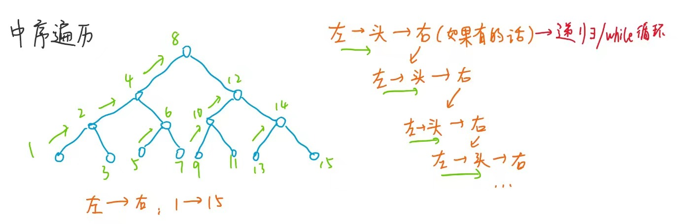

## 二叉树
结构：一个value值，两个指针指向左右孩子（类似链表多了个next指针...）  
度： 每个节点的子节点数量
根节点：最上面那个  
子节点：正常节点  
叶子节点：左右孩子都为null 
```C++
struct Node{
    int data;
    Node *left;
    Node *right;
};
class Tree{
public:
    Tree();
    ~Tree();
    void insert(int data);
    void remove(int data);
    void print();
private:
    Node *root;
    void insert(int data, Node *leaf);
    void remove(int data, Node *leaf);
    void print(Node *leaf);
};
Tree::Tree(){
    root = NULL;
}
Tree::~Tree(){}
```
### 深度优先遍历  
#### 递归遍历
递归时，每个节点都会经过自己三次，递归遍历分为以下3种  
先序遍历：头左右 --- 每个节点经过自己第一次的顺序  
中序遍历：左头右 --- 每个节点经过自己第二次的顺序  
后需遍历：左右头 --- 每个节点经过自己第三次的顺序  
省流： 3种遍历 分别对应 先头/中头/后头  
```C++
"来手传统递归，没错！就这么简单！！！"
void process(Node* head) {
    while (head != NULL){
        head->data = 1;
        "cout写在这里打印是先序遍历"
        process(head->left);
        "cout写在这里打印是先序遍历"
        process(head->right);
        "cout写在这里打印是先序遍历"
    }
}
```
#### while遍历
不用递归的方法？ 自己写一个栈，原理相同！  

**1.先序遍历： 头-左-右**  
先压入头节点到栈中，   打印处理栈顶元素，    弹出该元素，    该元素先右再左压入栈（如果有的话）   周而复始  
最后弹出栈元素，从栈顶到栈底，依次排开，为先序遍历的情况  


```C++
void frontPrint(Node* head){
    if (head != NULL){
        stack<Node*>stack;       "创建一个栈"
        stack.push(head);        "先把头节点压入栈中"
        while (!stack.empty()){  "如果栈中有元素，就执行while中的语句"
            "先打印，并弹出栈顶元素，最后先右后左压栈(如果有的话)"
            cout << stack.top();
            stack.pop();
            if (head->right != NULL){
                stack.push(head->right);
            }
            if (head->left != NULL){
                stack.push(head->left);
            }     "left后压栈，先出栈，实现先序遍历"
        }
    }
}
```
**2.中序遍历： 左-头-右**  
先遍历左边界进栈，然后依次弹栈，若弹出的元素有右子树，
则弹出这个“相对头节点”后，让其右儿子的左边界进栈（之后就是递归了）  


```C++
void middlePrint(Node* head){
    if (head != NULL){
        stack<Node*>stack;       "创建一个栈"
        "如果栈中有元素/当前头节点不为空 的话就执行while中的语句"
        while (!stack.empty() || head != NULL){
            "遍历该作用域下的左边界，直到指向空为止"
            if (head != NULL){
                "该节点压栈，然后指针指向下一个"
                stack.push(head);
                head = head->left;
            }else{  "左边界遍历完了，弹出最后一个左边界元素，然后指针指向右节点"
                "先访问该栈顶元素，再将它移除（因为它移除不返回Node* 而是返回void*  真服了...）"
                head = stack.top();
                cout << head->data << " " << endl;
                stack.pop();
                "如果有右树的话，head跳到右树上面去，将这个右节点作为相对头节点，继续递归(此处是while循环)~"
                head = head->right;
                "如果没有右树的话，那么会指向NULL，下一次循环还是来到这个else分支，然后head由指向NULL变为指向新的栈顶元素"
            }
        }
    }
}
```
**3.后序遍历： 左-右-头**  
本来按先序操作是：头-左-右，那我最后一步先左后右压入栈，那么就得到：头-右-左  
那么想得到的 左-右-头，就是头-右-左的逆序，要逆序，则需要加一个收集栈  
每次弹出cur后不直接打印出来，而是先放入收集栈， 再先左再右子节点压入原栈，最终弹出收集栈的内容即可逆序！  
```C++
void behindPrint(Node* head){
    if (head != NULL){
        "创建两个栈 ： 原栈、收集栈"
        stack<Node*>stack1;
        stack<Node*>stack2;
        stack1.push(head);    "先把头节点压入栈中"
        "如果栈中有元素，就执行while中的语句"
        while (!stack1.empty()){
            "不打印，而是将元素压入收集栈，再弹出原栈顶元素，最后先左后右压入原栈(如果有的话)"
            stack2.push(stack1.top()); 
            stack1.pop();
            if (head->left != NULL)
                stack1.push(head->left);
            if (head->right != NULL)
                stack1.push(head->right);
        }
        "最后弹出收集栈的元素，完成后序遍历"
        while (!stack2.empty()){
            cout << stack2.top() << " ";
            stack2.pop();
        }
    }
}
```
#### 判断搜索二叉树.cpp
对于每个节点，它的左子树都比它小，右子树都比它大（如果它有子树的话）  
判断方法：中序遍历时，一定是升序的序列  
1.直接中序遍历的时候放到列表里，最后遍历列表，判断是否是升序序列
```C++
bool isBST(Node* head){
    vector<Node*> list;
    process(head, list);
    for(int i = 1; i < list.size(); i++){
        if(list[i]->val <= list[i-1]->val)  return false;
    }
    return true;
}
void process(Node* head, vector<Node*>& inOrderList){
    if(head == nullptr)  return;
    process(head->left, inOrderList);
    inOrderList.push_back(head);
    process(head->right, inOrderList);
}
```
2.可用递归方式实现  
```C++
int preValue = -1;
bool isBST(Node* head) {
	if (head == NULL)   return true;
	"递归(直到最左位置)，对左子树判断是否是搜索二叉树"
	bool isLeftBst = isBST(head->left);
	
    "中序遍历的打印行为替换成判断行为"
	if (!isLeftBst)     return false;   "如果不是直接false"
	"如果(中间)节点小于左树上的节点，肯定不满足中序遍历，也直接false"
	if (head->data <= preValue)   return false;
	"head较大时，preValue更新为较大的值"
	else   preValue = head->data;    

	"左子树遍历完了，把右节点认为是头节点，对其(右子树)进行递归"
	return isBST(head->right);
}
```
3.中序遍历修改方式(非递归)


```C++
bool middlePrint(Node* head){
    if (head != NULL){
        int preValue = -1;           "先创建一个值"
        stack<Node*>stack;           "创建一个栈"
        "如果栈中有元素的话就执行while中的语句"
        while (!stack.empty() || head != NULL){
            if (head != NULL){
                stack.push(head);    "遍历该作用域下的左边界，过程中压栈，直到最深处"
                head = head->left;
            }else{      "左边界遍历完了，弹出最后一个左边界元素，然后指针指向右节点"
                head = stack.top();
                stack.pop();
                "打印行为换成下面的处理preValue: "
                "中序遍历，当前节点(右边的值)要始终比左边孩子的值大，才能为true"
                if (head->data <= preValue)   return false;
                else      preValue = head->data;
                "如果有右树的话，head跳到右树上面去，将这个右节点作为相对头节点，继续递归(此处是while循环)~"
                head = head->right;
            }
        }
        return true;   "整个while跑完都没问题，那就return true咯~"
    }
}
```
#### 判断搜索二叉树
**递归思路：每个节点都向我左树、右树要信息**
代码中，后序遍历的打印位置上，判断该节点是否比左树最大更大，比右树最小更小
```Java
"创建一个新类型，作为下面的返回值类型"
class ReturnData{
    bool isBST;     "该节点下的树是否为搜索二叉树"
    int min;        "右树最小"
    int max;        "左树最大"
    ReturnData(bool isBst, int mi, int ma){  "有参构造函数"
        isBST = isBst;
        min = mi;
        max = ma;
    }
};
ReturnData process(Node* x) {
    if (x == NULL)   return <NULL, <0, 0>>;
    ReturnData leftData = process(x->left);
    ReturnData rightData = process(x->right);
    "在后序遍历的位置上来处理数据"
    "1.拿到以当前节点为头节点的数的max,min"
    int min = x->data;
    int max = x->data;
    if (leftData != NULL) {
        min = Math.min(min, leftData.min);
        max = Math.max(max, leftData.max);
    }
    if (rightData != NULL) {
        min = Math.min(min, rightData.min);
        max = Math.max(max, rightData.max);
    }
    "进行isBST的判断"
    boolean isBST = true;
    "拿到左树最大和右树最小，跟该子树头节点比较，看是否满足二叉搜索（左<中<右）"
    if (leftData != NULL && (!leftData.isBST || leftData.max >= x.value)) {
        isBST = false;
    }
    if (rightData != NULL && (!rightData.isBST || x.value >= rightData.min)) {
        isBST = false;
    }
    return new ReturnData(isBST, min, max);   "子树的3个信息回溯return"
}
```
#### 满二叉树
所有层都满，共2^n -1个节点  
1.直接暴力解: 宽度优先遍历，统计节点个数和层数，进行关系比较就行 
**2.递归套路: 后序遍历的位置上，先向我左右子树要信息，再来判断**
```C++
bool isFull(Node* head){
    if(head == nullptr)   return true;
    Info* data = f(head);
    return data->nodes == (1 << data->height - 1);
}
class Info{
public:
    int height;
    int nodes;
    Info(int h, int n){
        height = h;
        nodes = n;
    }
}
Info f(Node* x){
    if(x == nullptr)    return new Info(0,0);
    Info* leftData = f(x->left);
    Info* rightData = f(x->right);
    int height = (leftData->height > rightData->height ? leftData->height : rightData->height) + 1;
    int nodes = leftData->nodes + rightData->nodes + 1;
    return new Info(height, nodes);
}
```
#### 平衡二叉树
搜索二叉树的改进版，既满足中序遍历时升序，又尽可能降低二叉树的高度，从而使查找的时间减少    
左子树和右子树的高度差不能超过1，与完全二叉树相似但不同，注意区分！  
**递归套路: 后序遍历的位置上，先向我左右子树要信息，再来判断**
```C++
"返回值类型：要返回是否是平衡二叉树，树的高度"
class ReturnType{
public:
	bool isBalanced;
	int height;
	ReturnType(bool isB, int hei){
		isBalanced = isB;
		height = hei;
	}
};
"判断+计算树高度 的函数(每个节点都要满足递归的三个要求：左平衡、右平衡、高度差不超过1)"
ReturnType* process(Node* x){
	if (x == NULL)   return new ReturnType(true, 0);
	"左右子树递归，返回两个信息，在后序遍历打印位置上作平衡判断"
	ReturnType* leftData = process(x->left);
	ReturnType* rightData = process(x->right);
	"(子)树的高度：左右子树的较大高度值+该节点1层"
	int height = (leftData->height > rightData->height ? leftData->height : rightData->height) + 1;
	"判断平衡条件：左右子树都是平衡二叉树，且高度差不超过1"
	bool isBalanced = leftData->isBalanced && rightData->isBalanced && abs(leftData->height - rightData->height) < 2;
	return new ReturnType(isBalanced, height);  "回溯时返回子树信息"
}
```
##### 平衡因子
左子树高度-右子树高度，有正有负，因此定义平衡二叉树时，规定平衡因子的绝对值<=1 
##### 调整方法（左旋右旋）
直接找到最小的不平衡子树，由根节点，沿最长路径寻找三个节点，进行交换(可以直接观察法，硬抠就LL RR LR RL ...)  
交换后就把这个子树其他节点接入进去，不难接入，应该只有一种接入方法  
##### 不足
左神只是保证高度差不超过1，搜索二叉树(中序升序)的部分要另外参考那部分代码！
#### 最小公共祖先
方法1: 代码长，好理解
所有节点设置fatherMap,将其和父连接起来  
然后o1节点往上回溯，将所有经过的节点都放入HashSet链条中  
最后o2节点也往上回溯，第一次回溯到的在HashSet的节点即为最小公共祖先，最坏情况是到了根节点  
```C++
Node* LowestAncestor(Node* head, Node* o1, Node* o2) {
    unordered_map<Node*, Node*> fatherMap;
    fatherMap.insert(head, head);
    process(head, fatherMap);
    unordered_set<Node*> set1;
    Node* cur = o1;
    while (cur != fatherMap[cur]) {    "不是头节点，可以往上窜！"
        set1.insert(o1);               "o1往上窜的节点都放入set链条中！"
        cur = fatherMap[cur];
    }
    set1.insert(head);
    "o2开始往上窜了，并在每一步检查是否窜到o1链条里面！"
    cur = o2;
    while (cur != fatherMap[cur]) {    "不是头节点，可以往上窜！"
        if (set1.count(cur)) {         "当o1链条有cur时，说明找到最小公共祖先，返回！"
            return cur;
        }
        cur = fatherMap[cur];
    }
}
"每个节点都设置其父节点放入哈希表里，head的father是它自己"
void process(Node* head, unordered_map<Node*, Node*> fatherMap) {
    if (head == nullptr)   return;
    fatherMap.insert(head->left, head);
    fatherMap.insert(head->right, head);
    "先把信息加到Map里，再去递归"
    process(head->left, fatherMap);
    process(head->right, fatherMap);
}
```
方法2: 代码短，不好理解
如图所示，一共两种大情况


```C++
Node* lowestAncestor(Node* head, Node* o1, Node* o2) {
    if (head == nullptr || head == o1 || head == o2) {
        return head;     "1)一个是另外一个的祖先 "
    }
    Node* left = lowestAncestor(head->left, o1, o2);
    Node* right = lowestAncestor(head->right, o1, o2);
    if (left != nullptr && right != nullptr) {
        return head;     "2)左右两边各自有一个o1、o2，返回这个祖先"
    }
    return left != nullptr ? left : right;   
    "1) / 2) 找不到，回溯时一直是null，如果找到了，那么将找到的值往上窜！"
}
```
#### 找后继节点
**寻找某节点(中序遍历情况下)的后继节点**
方法1: 直接中序遍历，放入列表查O(N)
方法2: 利用parent指针，找到k步之外的后继节点O(k)
```C++
class Node {
    int value;
    Node* left;
    Node* right;
    Node* parent;  "设root节点的parent是nullptr"
    Node(int data) {
        this->value = data;
    }
}
Node* getSuccessorNode(Node* node) {
    if (node == nullptr)   return node;
    if (node->right != nullptr) {           "1)有右树"
        return getLeftMost(node->right); "拿到右树最左节点"
    } else {                   "2)无右树，目标node属于某左树最右"
        Node* parent = node->parent;
        while (parent != nullptr && parent->left != node) {
            node = parent;          "往上窜"
            parent = node->parent;  
        }            "拿到哪个节点是其父节点的左孩子，返回其父节点"
        return parent;    
        "若parent==nullptr导致退出循环，说明node本来就是最后的节点，本来就是返回nullptr"
    }
}
Node* getLeftMost(Node* node) {     "拿到最左节点"
    if (node == nullptr)    return node;
    while (node->left != nullptr) {
        node = node->left;
    }
    return node;
}
```

#### AVL树(平衡搜索二叉树)
懒得写C++了，直接Java启动！


* 1.抽象二叉搜索树
就相当于二叉搜索树的具体实现，只需重写createNote就行
```Java
public class AbstractBinarySearchTree {
	public Node root;
	protected int size;
	
	public static class Node {
		"构造方法"
		public Node(Integer value, Node parent, Node left, Node right) {
			super();
			this.value = value;
			this.parent = parent;
			this.left = left;
			this.right = right;
		}
		"属性"
		public Integer value;
		public Node parent;
		public Node left;
		public Node right;
		"没孩子说明是叶子节点"
		public boolean isLeaf() {
			return left == null && right == null;
		}
		"随机生成一个哈希码"
		@Override
		public int hashCode() {
			final int prime = 31;
			int result = 1;
			result = prime * result + ((value == null) ? 0 : value.hashCode());
			return result;
		}
		"判断是否相等" 
		@Override
		public boolean equals(Object obj) {
			if (this == obj)   "地址值相同，说明一样！"
				return true;
			if (obj == null)   "null无法.equals，所以当前的对象一定非空，若obj为空，则一定不相等！"
				return false;
			if (getClass() != obj.getClass())   "对象class类别不同也是false"
				return false;
			Node other = (Node) obj;
			if (value == null) {       "当前值为空而obj的值不为空，false"
				if (other.value != null)
					return false;
			} else if (!value.equals(other.value))   "两个都有值但不相同，false "
				return false;
			return true;       "剩下两个都有值并且相同的情况，true "
		}
	}
	"创造节点，下面一般是根据父节点来创造子节点，后面的孩子基本都是null（因为本来空位置也不可能有左右孩子） "
	protected Node createNode(int value, Node parent, Node left, Node right) {
		return new Node(value, parent, left, right);   "即(value, parent, null, null)"
	}
	"寻找是否有值value为element的元素"
	public Node search(int element) {
		Node node = root;    "最开始从根节点开始查找"
		while (node != null && node.value != null && node.value != element) {
			if (element < node.value) {
				node = node.left;
			} else {
				node = node.right;
			}
		}
		return node;   "找不到节点返回null,找到节点说明node.value == element，此时退出，return 的 node 就是值为element的node"
	}
	"插入值为element的节点"
	public Node insert(int element) {
		if (root == null) {    "没有树就新建一个空节点（递归时表示此时来到空位，可以插入节点了）"
			root = createNode(element, null, null, null);    "单独一个节点，没有与其他关联（因为只有它一个节点）"
			size++;            "size变成1"
			return root;
		}
		if (search(element) != null)   return search(element);   "树中节点已存在，无需重复插入"
		Node insertParentNode = null;   "提前记录好插入的节点的可能的父节点，最后确定位置后，能保留父节点的信息（做到有所依赖）"
		Node searchTempNode = root;     "寻找可给element填进去的空位(比insertParentNode先走)"
		while (searchTempNode != null && searchTempNode.value != null) {
			insertParentNode = searchTempNode;    "每次都将可能的位置都设置成父节点"
			if (element < searchTempNode.value) {
				searchTempNode = searchTempNode.left;
			} else {
				searchTempNode = searchTempNode.right;
			}
		}
		"在父节点的下面插入值为element的节点作为左/右孩子，此时该节点必没有左右孩子，否则之前这两个左右孩子必没有爸爸！离谱！"
		Node newNode = createNode(element, insertParentNode, null, null);   
		if (newNode.value < insertParentNode.value) {
			insertParentNode.left = newNode;   "成为左孩子"
		} else {
			insertParentNode.right = newNode;  "成为右孩子"
		}
		size++;
		return newNode;
	}
	"1.按值删除节点"
	public Node delete(int element) {         
		Node deleteNode = search(element);    "找元素"
		if (deleteNode != null) {
			return delete(deleteNode);        "找到的元素不为空说明找到了，把它删了（调用下面的删除节点函数）"
		} else {
			return null;                      "本来就null，那就删除null(删了跟没删一样)"
		}
	}
	"2.按节点删除节点（使用该节点的右树最小的节点来代替这个即将被删除的节点）"
	protected Node delete(Node deleteNode) {
		Node nodeToReturn = null;
		if (deleteNode != null) {
			if (deleteNode.left == null) {          "左空/左右都空，右节点上来直接代替要删除的头节点(都空直接不影响)"
				nodeToReturn = transplant(deleteNode, deleteNode.right);
			} else if (deleteNode.right == null) {  "右空左不空，左节点上来代替"
				nodeToReturn = transplant(deleteNode, deleteNode.left);
			} else {       "左右都不空"
				Node successorNode = getMinimum(deleteNode.right);   "拿到右树最小"
				"情况1: 两点离得比较远，要先额外处理"
				"处理方法：让sus来到del节点的上方，确定好"相邻关系": 共同抢deleteNode.right这个右孩子"
				if (successorNode.parent != deleteNode) {            
					transplant(successorNode, successorNode.right);  "先把右树最小分离（离家出走，父亲没你这个儿子了！）"
					successorNode.right = deleteNode.right;          "下面这两步是将右树最小和要删除节点的右孩子双向链接"
					successorNode.right.parent = successorNode;
				}
				"情况2: 共同处理（此时del/suc节点相邻/靠近）"
				transplant(deleteNode, successorNode);
				successorNode.left = deleteNode.left;             "deleteNode.left节点和右树最小建立双向链接"
				successorNode.left.parent = successorNode;
				nodeToReturn = successorNode;                "successorNode节点成功替代了deleteNode节点！"
			}
			size--;
		}
		return nodeToReturn;     "返回新替代上来的头节点（如果要删除的节点不存在就 return null ）"
	}
	"要replace的节点，它的父亲的指针不再指向它，而是指向newNode，以及设置NewNode的爸爸(双向链接)"
	private Node transplant(Node nodeToReplace, Node newNode) {
		if (nodeToReplace.parent == null) {  "可怜的孩子，怎么没爸爸呢？原来它就是最原始的祖先，自己就是自己的爸爸！！！"
			this.root = newNode;             "那爸爸（就是自己）要被replace了，则新的root节点就被newNode替代"
		} else if (nodeToReplace == nodeToReplace.parent.left) {    "要被replace的节点是父亲的左孩子"
			nodeToReplace.parent.left = newNode;      "那么它父亲的左孩子指针将改为指向newNode"
		} else {
			nodeToReplace.parent.right = newNode;     "同理，父亲右孩子指针将改为指向newNode"
		}
		if (newNode != null) {    "== null 的话改指向就行了，不为空的话（一般情况都不为空），要设置newNode的爸爸（类似双向链接）"
			newNode.parent = nodeToReplace.parent;
		}
		return newNode;
	}
	"是否有element"
	public boolean contains(int element) {
		return search(element) != null;
	}
    "右树最小值"
	public int getMinimum() {
		return getMinimum(root).value;
	}
	"左树最大值"
	public int getMaximum() {
		return getMaximum(root).value;
	}
    "拿到后继节点的value值"
	public int getSuccessor(int element) {
		return getSuccessor(search(element)).value;
	}
	"节点总数"
	public int getSize() {
		return size;
	}
	"右树的最小节点，也就是一直向左树递归，找到最左边的节点并返回"
	protected Node getMinimum(Node node) {
		while (node.left != null) {
			node = node.left;
		}
		return node;
	}
	"左树的最大节点，也就是一直向右树递归，找到最右边的节点并返回"
	protected Node getMaximum(Node node) {
		while (node.right != null) {
			node = node.right;
		}
		return node;
	}
	"后继节点"
	protected Node getSuccessor(Node node) {
		"右树最小"
		if (node.right != null) {
			return getMinimum(node.right);
		} else { "没右树了，只能往上找祖先，使得当前node是目标祖先的左树最大，即祖先就是node的后继节点"
			Node currentNode = node;
			Node parentNode = node.parent;
			while (parentNode != null && currentNode == parentNode.right) {
				"回溯到祖先parent在current右边为止，即祖先在右边，作为后继节点"
				currentNode = parentNode;
				parentNode = parentNode.parent;
			}
			return parentNode;
		}
	}
}
```
* 2.抽象自我平衡二叉搜索树（只比二叉搜索树多了左旋右旋操作，需子类调用才能平衡，无法自动平衡）
```Java
public abstract class AbstractSelfBalancingBinarySearchTree extends AbstractBinarySearchTree {
	"RR左旋"
    protected Node rotateLeft(Node node) {
        Node temp = node.right;
        temp.parent = node.parent;
        node.right = temp.left;
        if (node.right != null) {
            node.right.parent = node;  "不null就让儿子认爹，建立双向链接"
        }
        temp.left = node;
        node.parent = temp;
        "改parent的指向，此时parent仍指向node，应该改为指向新的temp(根据node原先是parent的左还是右孩子来具体决定)"
        if (temp.parent != null) {
            if (node == temp.parent.left) {
                temp.parent.left = temp;     "node是parent的左孩子"
            } else {
                temp.parent.right = temp;    "node是parent的右孩子"
            }
        } else {
            root = temp;    "没爸爸，自己就是根节点（MyAVLTree似乎只考虑了这一点...）"
        }
        return temp;        "返回新的节点"
    }
    "LL右旋"
    protected Node rotateRight(Node node) {
        Node temp = node.left;
        temp.parent = node.parent;
        node.left = temp.right;
        if (node.left != null) {
            node.left.parent = node;   "先抢一手，如果抢到的话，让它认新爹"
        }
        temp.right = node;
        node.parent = temp;            "再认爹"
        if (temp.parent != null) {
            if (node == temp.parent.left) {   "顶级parent重新认temp为新儿子"
                temp.parent.left = temp;
            } else {
                temp.parent.right = temp;
            }
        } else {
            root = temp;
        }
        return temp;
    }
}
```
* 3.AVL树实现
```Java
public class AVLTree extends AbstractSelfBalancingBinarySearchTree{
	"创建节点，但是AVLNode型"
	protected Node createNode(int value, Node parent, Node left, Node right) {
		return new AVLNode(value, parent, left, right);
	}
	"插入操作"	
	public Node insert(int element) {
		Node newNode = super.insert(element);    "调用父类方法，直接使用其方法来插入"
		rebalance((AVLNode)newNode);   "插入后要检查是否平衡"
		return newNode;
	}
	"删除操作"
	public Node delete(int element) {
		Node deleteNode = super.search(element);
		if(deleteNode != null) {
			"谁替代了删除节点，返回谁"
			Node successorNode = super.delete(deleteNode);   "此时已经删除好了，successorNode顶替了deleteNode的位置"
			if(successorNode != null) {
				AVLNode minimum = successorNode.right != null ?
						(AVLNode)getMinimum(successorNode.right) : (AVLNode)successorNode;
				recomputeHeight(minimum);                       "右树最小or自身来重新计算高度和自平衡"
				rebalance((AVLNode)minimum);
			}else {
				recomputeHeight((AVLNode)deleteNode.parent);    "为空，只能找它爸爸计算高度和自平衡了"
				rebalance((AVLNode)deleteNode.parent);
			}
			return successorNode;
		}
		return null;
	}
	"自平衡操作"
	private void rebalance(AVLNode node) {   "一般调用情况都是: node为比较深层的子节点"
		while(node != null){
			Node parent = node.parent;
			int leftHeight = (node.left == null) ? -1 : ((AVLNode)node.left).height;
			int rightHeight = (node.right == null) ? -1 : ((AVLNode)node.right).height;
			int nodeBalance = rightHeight - leftHeight;
			if(nodeBalance == 2) {     "右长，R型"
				if(node.right.right != null) {
					node = (AVLNode)avlRotateLeft(node);            "RR"
					break;
				}else {
					node = (AVLNode)doubleRotateRightLeft(node);    "RL"
					break;
				}
			}else if(nodeBalance == -2){   "左长，L型"
				if(node.left.left != null) {
					node = (AVLNode)avlRotateRight(node);           "LL"
					break;
				}else {
					node = (AVLNode)doubleRotateLeftRight(node);    "LR"
					break;
				}
			}else {
				updateHeight(node);   "都要更新高度（上面的左旋右旋具体函数里面也有更新高度）"
			}
			node = (AVLNode)parent;   "往上窜去判断"
		}
	}
	"RR左旋"
	private Node avlRotateLeft(Node node) {
		Node temp = super.rotateLeft(node);
		updateHeight((AVLNode)temp.left);     "左旋具体更新高度操作"
		updateHeight((AVLNode)temp);
		return temp;
	}
	"LL右旋"
	private Node avlRotateRight(Node node) {
		Node temp = super.rotateRight(node);
		updateHeight((AVLNode)temp.right);    "右旋具体更新高度操作"
		updateHeight((AVLNode)temp);
		return temp;
	}
	"RL型"
    protected Node doubleRotateRightLeft(Node node) {
        node.right = avlRotateRight(node.right);
        return avlRotateLeft(node);
    }
    "LR型"
    protected Node doubleRotateLeftRight(Node node) {
        node.left = avlRotateLeft(node.left);
        return avlRotateRight(node);
    }
    "重新计算高度"
    private void recomputeHeight(AVLNode node) {  "node随便给的，可能在中间"
       while (node != null) {
          node.height = maxHeight((AVLNode)node.left, (AVLNode)node.right) + 1;   "先计算底下"
          node = (AVLNode)node.parent;        "再计算以上的节点高度"
       }
    }
    "返回较大高度，不存在就返回-1"
    private int maxHeight(AVLNode node1, AVLNode node2) {
        if (node1 != null && node2 != null) {
            return node1.height > node2.height ? node1.height : node2.height;
        } else if (node1 == null) {
            return node2 != null ? node2.height : -1;
        } else if (node2 == null) {
            return node1 != null ? node1.height : -1;
        }
        return -1;
    }
    "更新高度(若无子节点，则该节点的高度 = -1 + 1 = 0 ！！！不是1啊！！！)"
    private static final void updateHeight(AVLNode node) {   "node是AVL型，但它的left/right不是！所以要类强转"
        int leftHeight = (node.left == null) ? -1 : ((AVLNode) node.left).height;
        int rightHeight = (node.right == null) ? -1 : ((AVLNode) node.right).height;
        node.height = 1 + Math.max(leftHeight, rightHeight);
    }
    "比普通Node多了高度属性，因为平衡需要要求高度差不超过1！"
    protected static class AVLNode extends Node {
        public int height;

        public AVLNode(int value, Node parent, Node left, Node right) {
            super(value, parent, left, right);
        }
    }
}
```
#### 红黑树
**规则**
根节点、叶子节点必须黑色
红色节点不能相连
任意点出发到后代叶子节点的所有简单路径上，黑节点数量相同
**优势**
红黑颜色变化消耗时间少，主要耗时的左右旋，明显比AVL更少

#### 序列/反序列化
将二叉树以先序遍历的方式，将其存入队列中，利用队列先进先出的特性，等下出队列时顺序不变，可以按传统递归构建原来的树  
注意序列化时，要存入null和连线_，等下才能做字符串分割，以及什么时候到达叶子树，要换方向！  
序列化.jpg)
```C++
"序列化(先序版本)"
string serializeByPre(Node* head) {
    if (head == nullptr) {
        return "#_";
    }
    string res = to_string(head->value) + "_";
    res += serializeByPre(head->left);
    res += serializeByPre(head->right);
    return res;
}
"反序列化(先序版本)"
Node* reconstructByPreString(string preStr) {
    stringstream ss(preStr);
    string token;
    queue<string> myqueue;
    while (getline(ss, token, "_")) {  "ss以_来分割成若干个token，再加入队列中"
        myqueue.push(token);
    }
    return reconstructPreOrder(myqueue); "以先序遍历的方式来处理这个string队列"
}
Node* reconstructPreOrder(queue<string>& myqueue) {
    string value = myqueue.front();
    myqueue.pop();
    if (value == "#")    return nullptr;
    Node* head = new Node(stoi(value));   "stoi(): 字符串转换为int"
    head->left = reconstructPreOrder(myqueue);   "左右指针递归去连接"
    head->right = reconstructPreOrder(myqueue);
    return head;
}
```
还有中序、后序、按层遍历的版本，自己有兴趣再去琢磨(掌握一种即可!)...
#### 微软折痕问题
对折n次，遍历凹凸折痕的次序  
其实就是满二叉树：头节点凹，左节点都是凹，右节点都是凸  or （头节点凸，左节点都是凸，右节点都是凹）  
然后中序遍历就行了（主函数传对折次数 = 树的高度）
```C++
void printAllFolds(int N) {
    printProcess(1, N, true);    "主函数是1凹/头节点凹"
}
"递归过程，来到某一个节点"
"i是节点的层数，N是一共的层数，down == true: 凹   down == fanse: 凸"
void printProcess(int i, int N, boolean down) {
    if (i > N)    return;
    printProcess(i + 1, N, true);     "调用左凹"
    cout << down ? "down " : "up ";   "中序位置打印"
    printProcess(i + 1, N, false);    "调用右凸"
}
```
**优点**
只用N个空间(N层高度)，且只要搞成中序遍历的形式，能打印就行，不用真的构建一个二叉树结构出来！

### 宽度优先遍历(层序遍历)
按层遍历，利用队列来实现  
#### 宽度优先遍历实现
1.简单遍历：先放头节点进队列，然后 弹出队列中的一个元素，放该元素的左右节点进队列（没有就不放），周而复始  
```C++
void width(Node* head){
	if (head == NULL)   return;
	queue<Node*> queue;   "准备一个队列"
	queue.push(head);     "放入头节点"
	while (!queue.empty()){      "如果队列不为空就循环"
		head = queue.front();    "当前节点指向新弹出的元素"
		cout << head << " ";     "先打印，再弹出队头元素"
		queue.pop();
		"再让该元素的 先左后右 节点 插入队尾"
		if(head->left != NULL)
			queue.push(head->left);
		if(head->right != NULL)
			queue.push(head->right);
	}
}
```
2.宽度优先遍历的基础上，进行最多节点层的搜索，返回其层数和节点数
遍历时获取弹出节点的层数，插入时记录子节点的层数（父层数+1），放入哈希表里，周而复始  
如果遍历完一层，就更新max值，然后将当前这个新一层的节点数初始化为1  
```C++
int maxLevelNodes(Node* head){
	if (head == NULL)   return 0;
	queue<Node*> queue;   "准备一个队列"
	queue.push(head);     "放入头节点"
	unordered_map<Node*, int> levelMap;  "准备一张哈希表"
	levelMap.insert({ head, 1 });   "或者make_pair( )也行，放入处于第一层的头节点"
	"定义当前层、当前层节点、已找到的最大层的节点数"
	int curLevel = 1;
	int curLevelNodes = 0;
	int max = -1;
	while (!queue.empty()){
		Node* cur = queue.front();   "当前节点指向新弹出的元素"
		"拿到这个节点后，在levelMap中查出它的层数(key是first，value是second)"
		int curNodeLevel = levelMap.find(cur)->second;
		if (curNodeLevel = curLevel)  "1)节点还在当前层，当前层的节点数++"
			curLevelNodes++;
		else{    "2)否则该节点为下一层的第一个节点"
            "curLevelNodes已经++完了，直接更新max"
			max = curLevelNodes > max ? curLevelNodes : max;  
			curLevel++;           "下一层的初始化"
			curLevelNodes = 1;
		}
		queue.pop();    "上面front拿到元素处理完后，就pop扔掉！"
		"再让该元素的左右节点插入队尾"
		if (cur->left != NULL){
			"进队列前先记好它所在的层数，这样等到它作为队头元素弹出时，才能知道它的值"
			levelMap.insert({ cur->left, curNodeLevel + 1 });
			queue.push(cur->left);
		}
		if (cur->right != NULL){
			levelMap.insert({ cur->right, curNodeLevel + 1 });
			queue.push(cur->right);
		}
	}
	"如果队列为空，表示遍历完成，比较最后一层节点数量和 max 的值"
	max = curLevelNodes > max ? curLevelNodes : max;
	return max;
}
```
3.队列复杂coding实现：当前层最后一个节点curend、下一层最后一个节点nextend、当前层的节点数curLevel、max
每遍历到一个节点，如果不是当前层最后一个，那就curLevel++，最后进队列的记为nextend
如果遍历到的节点=最后一个节点curend，那么下一次的最后一个节点赋值给当前层的最后一个节点，nextend设为null，记录新的max
4.战神实现    **力扣102**
直接for循环，每遍历一层，就让level++，
同时记录队列里面的值size()，就是当前层的节点数，也是下一层循环的次数！
每遍历完一层，max记得更新即可
```C++
vector<vector<int>> levelOrder(TreeNode* root) {
    vector <vector <int>> ret;
    if (!root)   return ret;
    queue <TreeNode*> q;
    q.push(root);
    int level = 1;
    int maxLevel = 1;
    int max = 0;
    while (!q.empty()) {
        int currentLevelSize = q.size();
        "每遍历完一层后，更新max和对应的层数maxLevel"
        max = currentLevelSize > max ? currentLevelSize : max;
        maxLevel = currentLevelSize > max ? level : maxLevel;
        ret.push_back(vector <int> ());
        for (int i = 1; i <= currentLevelSize; ++i) {
            auto node = q.front(); q.pop();   "先拿到节点再弹出"
            ret.back().push_back(node->val);
            if (node->left) q.push(node->left);
            if (node->right) q.push(node->right);
        }
        level++;
    }
    return ret;   "原题是返回层序遍历的二维数组"
}
```
#### 完全二叉树
所有层都满，或者最后一层最左边的部分元素都满  
判断条件1：所有节点不存在  无左有右  节点的情况  
判断条件2：如果宽度优先遍历到有一个节点“有左无右”/“无左无右”，那么之后的节点都是叶子节点  
所以如果之后还有节点不是叶子节点，那么直接false 
```C++
bool isCBT(Node* head){
    if (head == nullptr)   return true;
    queue<Node*> q;
    bool leaf = false;
    Node* l = nuulptr;
    Node* r = nullptr;
    q.push(head);
    while(!q.isEmpty()){
        head = q.front();
        q.pop();
        l = head->left;
        r = head->right;
        if((leaf && (l != nullptr || r != nullptr))
                ||       "1)已经遇到过两个节点不双全，但是后面的不是叶子节点"                
            (l == nullptr && r != nullptr)) {    "2)有右无左，直接false"
            return false;
        }
        if (l != nullptr) {
            q.push(l);
        }
        if (r != nullptr) {
            q.push(r);
        } else {
            leaf = true;   "一旦找到无右孩子，直接后面都是叶子节点leaf"
        }
    }
    return true;
}
```

## 非二叉树
### 前缀树/字典树
前缀一样的就走一样的路，不一样的就分出来岔路  
pass记录经过到该节点的路的次数，end记录以该节点结尾的路的总数  
```C++
class TrieNode {
public:
    int pass;
    int end;
    vector<TrieNode*> nexts;
    TrieNode() {
        pass = 0;
        end = 0;
        nexts = vector<TrieNode*>(26, nullptr);
        "如果字符种类过多，可以使用：unordered_map<char, TrieNode*> nexts;"
    }
};
class Trie {
private:
    TrieNode* root;
public:
    Trie() {
        root = new TrieNode();
    }
    void insert(string word) {
        if (word.empty()) 
            return;
        TrieNode* node = root;
        node->pass++;     "要处理空串就最好加上这句"
        for (char ch : word) {
            int index = ch - "a";
            if (node->nexts[index] == nullptr) {
                node->nexts[index] = new TrieNode();
            }
            node = node->nexts[index];
            node->pass++;
        }
        node->end++;
    }
    void deleteNode(TrieNode* node) {
        if (node == nullptr) {
            return;
        }
        "下级可能有多条路，要分别遍历递归来删除"
        for (TrieNode* child : node->nexts) {
            deleteNode(child);
        }
        delete node;
    }
    void remove(string word) {
        if (search(word) != 0) {
            TrieNode* node = root;
            for (char ch : word) {
                int index = ch - "a";
                "-- 是肯定要的，但是如果减完==0.那么后面的路断了，全删了！"
                if (--node->nexts[index]->pass == 0) {
                    deleteNode(node->nexts[index]);
                    "C++需要递归删除，Java会将找不到的内存空间自动释放！"
                    node->nexts[index] = nullptr;
                    return;
                }
                node = node->nexts[index];
            }
            node->end--;
        }
    }
    "返回word这个单词之前加入的次数"
    int search(string word) {
        if (word.empty()) 
            return 0;
        TrieNode* node = root;
        for (char ch : word) {
            int index = ch - "a";
            if (node->nexts[index] == nullptr) {
                return 0;
            }
            node = node->nexts[index];
        }
        return node->end;
    }
    "所有加入的字符串中，有几个是以pre这个字符串作为前缀的"
    int prefixNumber(string pre) {
        if (pre.empty()) 
            return 0;
        TrieNode* node = root;
        for (char ch : pre) {
            int index = ch - "a";
            if (node->nexts[index] == nullptr) {
                return 0;
            }
            node = node->nexts[index];
        }
        return node->pass;
    }
}
```

## B树B+树

结构图如下：


### B树

多叉树，叶子节点的层数保持一致（也就是没高度差）

### B+树

数据都存储在叶子节点，这样上层只需存储指针就行，在相同层数中可以存储更多的数据，可以使得I/O次数减少

在叶子层中会用指针连接在一起，增强顺序查找提高效率

## 森林

就是普通的多叉树，只不过可能有多个树，共同构成森林

### 森林转二叉树

森林中不要想什么左右子树的概念

- 当节点有一个孩子时，转为二叉树后还是孩子，位于左子树的位置
- 当节点有不止一个孩子时，第一个孩子作为大哥，还是在左子树，右侧其他兄弟变为大哥的儿子，在右子树方向上排列下去

### 哈夫曼树

**构造哈夫曼树步骤**

1、根据给定的n个权值{w1,w2, ..... n}，构造n棵只有根结点的二叉树。
2、在森林中选取两棵根结点权值最小的树作左右子树，构造一棵新的二叉树，置新二叉树根结点权值为其左右子树根结点权值之和。
3、在森林中删除这两棵树，同时将新得到的二叉树加入森林中。
4、重复上述两步，直到只含一棵树为止，这棵树即哈夫曼树。

- 基本思想：使权大的结点靠近根
- 操作要点：对权值的合并、删除与替换,总是合并当前值最小的两个

### haffman编码（考计算平均码长）

规定哈夫曼树中的左分支为0，右分支为1，则从根结点到每个叶结点所经过的分支对应的0和1组成的序列，便为该结点对应字符的编码

**特点**

- 权值越大的字符编码越短，反之越长（类比权值越大，使用越频繁，需要更短编码提高效率）
- 最后一层才有权值，其与深度相乘后累加
- 前缀编码，两个编码的尾部一定不同，不可能说一个是另一个的前缀（子集关系还没到叶子节点都没编码完，别搞笑了hhh）

