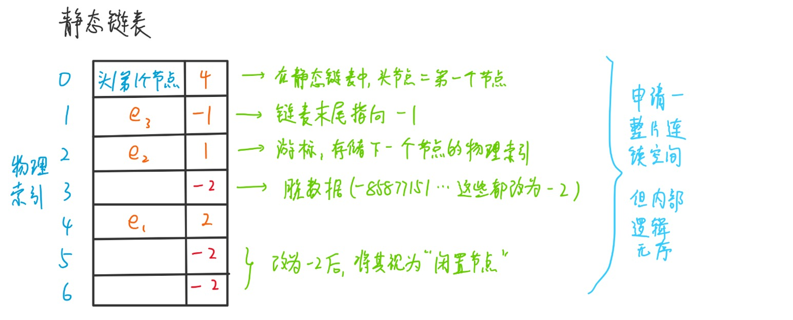
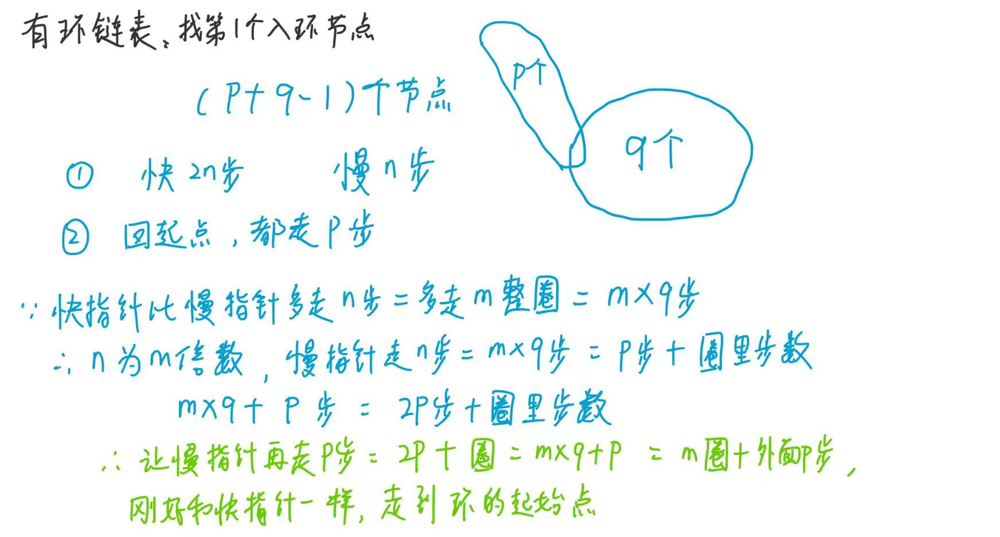

## 1 顺序表
顺序存储结构的线性表，内存空间相邻  
### 1.1 普通顺序表
跟数组类似，不过增加了按值查找位置，在指定位置插入元素等操作(数组plus)  
插入时，要将后面的数字都右移一位，腾出空间插入  
删除时，将该元素后面的元素都依次往前覆盖一位即可(不能从右到左，防止数据丢失！)  

### 1.2 数组
就是普通的数组(默认指静态数组， 动态数组就跟顺序表的一般性接近了)  
```C++
'比如内部的索引=位置-1已经封装起来，外面看上去，索引跟位置对应！  指定插入位置等......'
#define MAXSIZE 10
class SqList{
public:
    int data[MAXSIZE];  '存放数组的10个数据'
    int length;         '数组长度'
};
void InitList(SqList& L){     '初始化顺序表'
    L.length = 0;
}
'以下传进来的i都表示第i个，对应的是索引i-1'
'插入第i个(i-1索引上的)值为e的元素(索引i位置及其以后的元素往后移)'
void ListInsert(SqList& L, int i, int e)  {
    if (i < 1 || i > L.length + 1){
        cout << "插入位置不合法" << endl;
        return;
    }
    if (L.length >= MAXSIZE){
        cout << "顺序表已满" << endl;
        return;
    }
    for (int j = L.length; j >= i; j--){
        '所有元素后移，腾出该位置(第i个，索引i-1)的空间'
        L.data[j] = L.data[j - 1];
    }
    L.data[i - 1] = e;
    L.length++;
}
'删除第i个(i-1索引上的)元素,并用e接收被删除的元素的值'
bool ListDelete(SqList& L, int i, int& e)  {
    if (i < 1 || i > L.length){
        cout << "删除位置不合法" << endl;
        return false;
    }
    e = L.data[i - 1];     'e接收被删除的元素'
    '跟插入相反，删除后，后面的元素都要往左(前)挪一位'
    for (int j = i; j < L.length; j++){
        '从i放入i-1开始，一直到len-1(数组最后一个元素)到len-2'
        L.data[j - 1] = L.data[j];
    }
    L.length--;
    return true;
}
int GetElem(SqList L, int i){     '按位获取元素'
    if (i < 1 || i > L.length){
        cout << "获取位置不合法" << endl;
        return -1;
    }
    return L.data[i - 1];
}
int LocateElem(SqList L, int e){   '按值查找元素'
    for (int i = 0; i < L.length; i++){
        if (L.data[i] == e)
            return i + 1;    '索引位置+1,获得实际位置'
    }
    return -1;             '找不到该元素，返回负数索引！'
}
```
## 2 链表  
链式存储结构的线性表
### 2.1 单链表
单链表有带/不带头结点两种写法；若带头结点，则头结点的data为null，next指向第一个节点
```C++
'方法1'
typedef struct Node {
    int data;
    struct Node* next;
} Node;                  'typedef的末尾必须写跟开头一样的名称: Node'
typedef Node* LinkList;  '想要写Node*类型的LinkList需要重新写一句typedef'
'方法2'
typedef struct Node{
    int data;
    struct Node* next;
}Node, *LinkList;        '同样是Node类型的，可以写在一句中'  
'Node(==struct Node) is a struct (即节点)'
'LinkList(==struct Node*) is a pointer to Node  (即指向节点的指针)'
'省流！！！ Node* == Linklist           xxx* : 一个指针类型'
'方法3'
class Node {
public:
    int data;
    Node* next;
};
typedef Node* LinkList;  '对 Node* 取一个别名 LinkList'
```
初始化一个单链表
```C++
'------不带头节点-------'
bool InitList0(LinkList &L){
    L = NULL;           '空表，暂时还没有任何节点'
    return true;
}
'------带头节点-------'
bool InitList(LinkList &L){
    L = (LinkList)malloc(sizeof(Node));  '分配一个头节点'
    if(L == NULL) 
        return false;                    '内存不足，分配失败'
    L->next = NULL;                      '头节点之后暂时没有节点'
    return true;
}
```
```
L->data               == Node.data;
L->next               == Node.next;
L->next->data         == Node.next.data;
L->next->next;        == Node.next.next;
L->next->next->data;  == Node.next.next.data;
L->next->next->next;  == Node.next.next.next;
......
懂我意思？   一级指针指向下一个节点，二级指针指向下一个节点的数据域
这样说下去，感觉有n多级指针......
L为一个Node对象的指针，(可以指向)data和next两个属性，data是int型，next是指针型，指向下一个节点
通过指针->的方式，可以访问Node对象的两个属性 or 直接对象.属性
知道头指针(第一个对象)，就相当于有了一整条链表！可以不断-> -> -> ......
```
查找节点
```C++
'按位查找-第i个节点(带头节点L)'
LinkList GetElem(LinkList L, int i, int &e){
    LinkList p = L->next;             'p指向第一个节点'
    int j = 1;                        '计数器'
    while(p && j < i){                'p不为空且计数器j还没有等于i时，循环继续'
        p = p->next;                  'p指向下一个节点'
        ++j;
    }
    if(!p || j > i)                   '第i个元素不存在(j == i 时，p指向NULL || j > i越界)'
        return NULL;
    e = p->data;                      'e是引用类型，将p的data赋值给e，e就存第i个元素的值'
    return p;                         '返回第i个元素的地址'
}
'按值查找-查找值为e的节点(带头节点)'
LinkList LocateElem(LinkList L, int e){
    LinkList p = L->next;             'p指向第一个节点'
    while(p != NULL && p->data != e)  'p不为空且p的data不等于e时，循环继续'
        p = p->next;
    if(p == NULL)                     'p为空，说明没有找到值为e的元素，返回NULL'
        return NULL;
    return p;                         '找到了，返回p'
}
```
插入节点
```C++
'在第i个位置插入一个元素e(带头节点)'
bool InsertNextNode(Node* p, int e);  '先声明一下'
bool ListInsert(LinkList &L, int i, int e){
    LinkList p = L;                   'p指向扫描到的节点，当前指向头节点'
    int j = 0;
    while(p && j < i-1) {             '寻找第i-2个节点'
        p = p->next;    '循环到最后的i-2位置后，进行最后一次赋值，让p指向第i-1个节点，即目标节点的前一个位置！'
        ++j;
    }
    return InsertNextNode(p, e);      '找到对应的p位置后，才能调用后插操作(malloc也在里面)'
}
'在第i个位置插入一个元素e(不带头节点)'
bool ListInsert0(LinkList &L, int i, int e){
    if(i < 1) 
        return false;
    if(i == 1){                       '在第一个位置插入'
        '由于没有头结点，没有初始分配好内存空间，所以要在这里malloc'
        LinkList s = (LinkList)malloc(sizeof(Node));
        '相比于中间的前插操作，头节点前面无节点，因此只需两步就能完成'
        s->data = e;                  '赋值'
        s->next = L;                  '指向原来第一个节点'
        L = s;                        '将新节点作为第一个节点'
        return true;
    }
    Node *p = L;                      '可移动的指针，最开始跟头结点一样，指向第一个node'
    int j = 1;
    while(p && j < i-1){              '寻找第i-1个节点'
        p = p->next;
        ++j;
    }
    '以下部分也可以调用后插函数InsertNextNode(p, e)'
    if(!p)                            'i大于表长+1,插入的位置过大，链表没有这么长，相当于越界'
        return false;
    LinkList s = (LinkList)malloc(sizeof(Node));   '分配一个新节点'
    if (s == NULL)
        return false;                 '防止内存分配失败引发异常'
    s->data = e;                      '将e赋值给新节点'
    s->next = p->next;                '将p的后继节点赋值给新节点的后继'
    p->next = s;                      '将新节点赋值给p的后继'
    return true;
}
```
求单链表的长度(带头节点)    
```C++
'后加后结束(第一个节点 - 倒数第一个节点)'
int ListLengthB(LinkList L){
    int len = 0;
    LinkList p = L->next;             'p指向第一个节点node'
    while(p){                         'p不为空时，循环继续'
        ++len;
        p = p->next;
    }
    return len;
}
'先加先结束(头结点 - 倒数第二个节点)'
int ListLengthF(LinkList L){
    int len = 0;
    LinkList p = L;                   'p指向头节点'
    while(p->next != NULL){           'p的下一个节点不为空时，循环继续'
        ++len;
        p = p->next;
    }
    return len;
}
```

后插操作：在p节点之后插入元素e

```C++
'从p节点开始，能访问后面的节点，但由于是单链表，不能访问前面的节点(除非传参插入头节点)'
bool InsertNextNode(Node *p, int e){
    if(p == NULL) 
        return false;
    Node *s = (Node *)malloc(sizeof(Node));
    if(s == NULL) 
        return false;    '内存满了，内存申请分配失败(如内存不足，极少发生，这两行代码可以不写)'
    s->data = e;
    s->next = p->next;   '此时的p->next是指向原来的下一个节点/null的'
    p->next = s;         '经典的插入“三操作”'
    return true;
}
```

前插操作：在p节点之前插入元素e
```C++
bool InsertPriorNode(Node *p, int e){
    if(p == NULL) 
        return false;
    Node *s = (Node *)malloc(sizeof(Node));
    if(s == NULL) 
        return false;    '内存满了，内存申请分配失败(如内存不足，极少发生，这两行代码可以不写)'
    '1、2步先后插'
    s->next = p->next;
    p->next = s;
    '3、4步再处理数据'
    s->data = p->data;  
    p->data = e;
    '--------为何操作如此繁琐，不能直接在p之前插入？--------'
    '因为单链表，不知道p之前是哪个节点，即：只能找到后继不能找到前驱！'
    '所以只能先利用后继那些能访问的节点进行(后插)操作，再对数据进行处理'
    return true;
}
```
删除节点
```C++
'删除第i个元素(带头节点)'
bool ListDelete(LinkList &L, int i, int &e){
    if(i<1) 
        return false;
    LinkList p = L;
    int j = 0;
    while(p->next && j < i-1){      '寻找第i-1个节点，目的是让p能够指向第i-1个节点之后的第i个节点'
        p = p->next;
        ++j;
    }
    if(!(p->next) || j > i-1)       '链表的下一个节点为空或者j异常越界'
        return false;
    LinkList q = p->next;           'q指向第i个(要被删除的)节点'
    p->next = q->next;              '将p的后继不指向q,而是指向q的后继r'
    e = q->data;                    '将q的数据域赋值给e(存储被删除的元素数据)'
    free(q);                        '释放q所指向的内存,包括q的数据域和指针域'
    return true;
}
'删除指定节点p(给了节点位置，就不用重头开始遍历寻找了！)'
bool DeleteNode(Node *p){
    if(p == NULL) 
        return false;
    '实现逻辑：让p拿到的下一个节点q的数据后，其next直接指向q的下一个节点，最后把q删了就行'
    Node *q = p->next;              'q指向p的后继'
    p->data = q->data;              '将q的数据域赋值给p的数据域'
    p->next = q->next;              '将q的后继赋值给p的后继'
    free(q);                        '释放q所指向的内存，使被删去的元素的前一个元素p的next指针指向NULL'
    return true;
}
```
建立单链表
```C++
'尾插法建立单链表(带头节点)'
void CreateListR(LinkList &L, int n){   '尾插入n个节点'
    L = (LinkList)malloc(sizeof(Node)); '分配一个头节点'
    L->next = NULL;                     '头节点的next指针指向NULL'
    LinkList r = L;                     'r指向尾节点(此时没有元素，头尾一样)'
    for(int i=0; i<n; i++){
        LinkList p = (LinkList)malloc(sizeof(Node));  '分配一个新节点'
        cin >> p->data;                 '输入元素值'
        cout << "第" << i+1 << "个节点输入成功！" << endl;
        r->next = p;                    '将表尾终端节点的指针指向新节点p'
        r = p;                          '类似cur指针，动态指向'
    }
    r->next = NULL;                     '表示当前链表结束'
}
'头插法建立单链表(带头节点)'
void CreateListF(LinkList &L, int n){
    L = (LinkList)malloc(sizeof(Node)); '分配一个头节点'
    L->next = NULL;                     '头节点的next指针指向NULL，防止原来头指针指向脏数据'
    for(int i=0; i<n; i++){
        LinkList p = (LinkList)malloc(sizeof(Node));  '分配一个新节点'
        cin >> p->data;                 '输入元素值'
        p->next = L->next;              '将新节点的next指针指向头节点的后继(新的第二个节点)'
        L->next = p;                    '头节点后继指向新插入的 第一个节点'
    }
}
```
### 2.2 双链表
双链表一般带头节点，头节点的prev指向空，尾节点的next指向空
```C++
typedef struct Node{
    int data;
    Node *next;
    Node *prev;
}Node, *DLinkList;
```
初始化双链表
```C++
bool InitList(Node *&L){
    L = new Node;
    if (L == NULL){
        cout << "内存分配失败！" << endl;
        return false;
    }
    L->next = NULL;
    L->prev = NULL;
    return true;
}
```
插入节点
```C++
'后插入节点  (在p节点之后插入s节点)'
'p, p->next   -->    p, s, p->next'
bool InsertNextNode(Node *p, Node *s){
    if (p == NULL || s == NULL)
        return false;
    's、p->next的互指'
    s->next = p->next;     '可能出现p->next==NULL的情况，即p之后没有节点，这时s插在末尾其next也是NULL，没毛病'
    if (p->next != NULL)
        p->next->prev = s;   '如果p原来后面还有节点，那么该节点的prev要指向插进来的s'
    'p、s的互指'
    p->next = s;
    s->prev = p;         
    return true;
}
```

```C++
'插入节点  (在p节点之前插入s节点)'
bool InsertPrevNode(Node *p, Node *s){
    if (p == NULL || s == NULL)
        return false;
    's、p->prev的互指'
    s->prev = p->prev;       '(1)'
    if (p->prev != NULL)
        p->prev->next = s;   '(2)'
    's、p的互指'
    s->next = p;             '(3)'
    p->prev = s;             '(4)'
    return true;
}
```
删除释放节点

```C++
'删除节点  (删除p节点之后的一个节点)'
bool DeleteNextNode(Node *p){
    if (p == NULL)           '传入的p节点不存在'
        return false;
    Node *q = p->next;       
    if (q == NULL)           'p节点之后没有节点，只能说删除了空气...'
        return false;
    p->next = q->next;       '(1)'
    '如果q->next == NULL, 说明删除后，p后面没有节点了；那么p->next指向NULL，不用执行下面if语句了'
    if (q->next != NULL)     'q节点之后还有节点'
        q->next->prev = p;   '(2)'
    delete q;
    return true;
}
'循环释放双链表'
void DestroyList(Node *L){
    Node *current = L->next;     '指向第一个数据节点'
    Node *temp;
    while (current != NULL) {
        temp = current->next;    '保存下一个节点的指针'
        DeleteNode(current);     '删除当前节点'
        current = temp;          '移动到下一个节点'
    }
    delete L;                    '释放头节点'
    L = NULL;                    '头指针置空'
}
```
遍历双链表
```C++
'后向遍历双链表（遍历头节点之后的）'
void ListTraverse(Node *L){
    Node *p = L->next;           'p指向第一个节点'
    while (p != NULL){
        cout << p->data << " ";
        p = p->next;             '最后一个指向null，不要访问就没什么问题'
    }
}
'前向遍历双链表'
void ListTraverseBack(Node *q){
    Node *p = q->prev;           'p为q的前驱节点(即前一个节点)'
    while (p->prev != NULL){     '遍历到头节点的->prev == NULL，循环结束'
        cout << p->data << " ";
        p = p->prev;             '最后一次时，p->prev为头指针，赋值给p'
    }
}
```
### 2.3 循环单链表
单链表最后一个元素的next指针指向头节点  
注意delete时，要搞个别名delete q, 不要直接delete p->next! 会有命名冲突，导致指针访问越界！  

```C++
'初始化循环单链表'
bool InitList(LinkList &L){
    L = new Node;
    if (L == NULL){
        cout << "内存分配失败！" << endl;
        return false;
    }
    L->next = L;    '头节点的next指向自己'
    return true;
}
'判断循环单链表是否为空'
bool Empty(LinkList L){
    if (L->next == L)  return true;
    else               return false;
}
'判断节点p是否为循环单链表的最后一个节点'
bool IsLast(LinkList L, Node *p){
    if (p->next == L)  return true;
    else               return false;
}
```
```C++
'第i位置上插入元素e'
void InsertList(LinkList L, int i, int e){
    Node* p = L;
    'e装进s节点'
    Node* s = (Node*)malloc(sizeof(Node));
    s->data = e;
    '先走到i-1位置上'
    for (int j = 0; j < i - 1; j++){
        if (p->next == L){       'i过大    && p->next->next != L 感觉没啥用...'
            cout << "插入位置不合法" << endl;
            return;
        }
        p = p->next;
    }
    '再执行插入s操作'
    s->next = p->next;
    p->next = s;
}
'删除第i位元素q'
void DeleteList(LinkList L, int i, int e){
    Node* p = L;
    '先走到i-1位置上'
    for (int j = 0; j < i - 1; j++){
        if (p->next == L){
            cout << "删除位置不合法" << endl;
            return;
        }
        p = p->next;
    }
    '再执行删除i位置元素的操作'
    Node* q = p->next;    '一定要弄个q别名来存数据！否则数据丢失/命名冲突！'
    e = q->data;
    p->next = q->next;
    delete q;
    q = NULL;
}
'遍历循环单链表'
void printList(LinkList L){
    Node* p = L;
    if (p->next == L){
        cout << "链表为空！" << endl;
        return;
    }
    while (p->next != L){
        p = p->next;
        cout << "当前数据" << p->data << " ";
        cout << endl;
    }
}
```
### 2.4 循环双链表
双链表最后一个元素的next指针指向头节点，头指针的prev指向最后一个节点  
isEmpty和循环单链表一样
```C++
'初始化循环双链表'
bool InitList(DLinkList &L){
    L = new Node;
    if (L == NULL){
        cout << "内存分配失败！" << endl;
        return false;
    }
    L->next = L;    '头节点的next指向自己'
    L->prev = L;    '头节点的prev指向自己'
    return true;
}
'判断节点p是否为循环双链表的最后一个节点'
bool IsLast(DLinkList L, Node *p){
    if (p->next == L || L->prev == p)  return true;
    else      return false;
}
'插入节点  (在p节点之后插入s节点)'
bool InsertNextNode(Node *p, Node *s){
    if (p == NULL || s == NULL)
        return false;
    s->next = p->next;       '(1)'
    'p节点之后不可能没有节点，因为是循环闭环，每个指针都不为空'
    // if (p->next != NULL)  
    p->next->prev = s;       '(2)'
    p->next = s;             '(3)'
    s->prev = p;             '(4)'
    return true;
}
'删除节点  (删除p节点之后的节点q)'
bool DeleteNextNode(Node *p){
    if (p == NULL)       return false;
    Node *q = p->next;
    'p节点之后不可能没有节点，因为是循环闭环，每个指针都不为空'
    // if (q == NULL)    return false;
    p->next = q->next;
    q->next->prev = p;
    delete q;         
    return true;
}
'循环遍历整个双链表'
void printDList(DLinkList L){
    Node* p = L->next;        'p指向第一个节点'
    while (p != L){           '不能写 !NULL ，因为循环链表所有指针都不为NULL!'
        cout << p->data << " ";
        p = p->next;
    }
    '注：除了头节点不能遍历到，其他从第一个节点开始，都可以遍历到！'
}
```
### 2.5 静态链表
内存空间连续，但存放无序的链表，指针域为int索引  
若数据为int，则通过 p+8* 游标，就能找到下一个元素的位置(因为每个节点=int数据+int游标=8字节)

```C++
'定义静态链表'
#define MAXSIZE 100  '静态链表的最大长度'
typedef struct{
   int data;
   int next;    '游标，为0时表示无指向,游标类似于数组的下标，充当指针，指向数组的对应下标的节点'
}Node, SLinkList[MAXSIZE];   '一个表示一个节点，一个表示一个静态链表'
```
```C++
'初始化静态链表(完全初始化，每个数据都填满值)'
bool InitList(SLinkList &LArr){
    '数值设置为101-200，游标设置为1-100，默认顺序排列像数组一样，想要游标随机就用srand等方法'
    for (int i = 0; i < MAXSIZE; i++){
        if (i == MAXSIZE - 1){
            LArr[i].data = 101 + i;
            LArr[MAXSIZE - 1].next = -1;     '最后一个元素的next指向-1'
            return true;
        }
        LArr[i].data = 101 + i;
        LArr[i].next = i + 1;
    }
    return true;
}
'打印静态链表'
void printSList(SLinkList& LArr){
    for (int i = 0; i < MAXSIZE; i++){
        cout << LArr[i].data << " ";
    }
    cout << endl;
}
```

### 2.6 回文链表（左神）
先说明前置知识

```C++
'复制单链表'
Node* CopyList(Node* L) {
    if (L == nullptr)    return nullptr;  
    Node* original = L;           '原链表的遍历指针'
    Node* copyHead = nullptr;     '复制链表的头节点指针'
    Node* copyTail = nullptr;     '复制链表的尾节点指针'
    while (original != nullptr) {
        '先对新节点做好处理'
        Node* newNode = new Node;        '创建新节点'
        newNode->data = original->data;  '复制节点的值'
        newNode->next = nullptr;         '初始化新节点的next指针'
        '在进行新节点连接进链表的处理'
        '如果原有链表为空'
        if (copyHead == nullptr) {
            copyHead = newNode;    '第一个节点作为头节点'
            copyTail = newNode;    '同时也是尾节点'
        }else {    '如果原有链表已有节点'
            copyTail->next = newNode;     '将新节点链接到复制链表的尾部'
            copyTail = newNode;           '更新尾节点指针'
        }
        original = original->next;        '原链表指针后移'
    }
    return copyHead;     '返回复制链表的头节点指针'
}
'反转单链表/逆序'
Node* reverseList(Node* head){
    Node* prev = nullptr;
    Node* current = head;
    Node* next = nullptr;
    while (current != nullptr){
        next = current->next;   '提前保存当前节点的下一个节点'
        current->next = prev;   '反转指针方向，第一个指向null(本来指向后面，改成指向前面了)'
        prev = current;         '移动 prev 指针'
        current = next;         '移动 current 指针，多亏next的提前保存'
    }
    head = prev;                '逆序后，原尾节点更新为头节点并返回'
    return head;                
}
```
判断该链表是否为回文链表  2种方式
1.用**栈**，压入弹出后逆序，每遍历一个，就跟栈弹出的那个比较是否一样，所有一样则回文  
其实要复制一份，让复制的那一份反转，然后遍历这两个链表看是否相同（思想跟栈差不多）  
2.**快慢指针**，快指针走快2倍，走到末尾停下，此时慢指针走到中间（分奇偶讨论）  
判断完能够用反转单链表的方法，把结构调回来那更好！ 

```C++
'方法1.使用栈(此处解法没用到stack，而是用逆序达到类似效果)'
'要用栈的话，应该可以写Stack<Node>的类型来存节点'
bool IsBackList1(Node*& L){
    '反转单链表，然后再将两个链表一一比对'
    Node* p = L;
    Node* q = CopyList(L);    '先复制一份链表出来'
    q = reverseList(q);       '再反转q单链表，q为反转后新的起点'
    '最后再将这两个链表进行比较'
    while (p != NULL){        'p、q长度都一样，判断条件写一个就行'
        if (p->data != q->data)
            return false;     '但凡有一个不一样都不回文，不给机会！'
        p = p->next;
        q = q->next;
    }
    return true;              '坚持到最后，说明反转后都相同，直接回文'
}
```
```C++
'方法2.利用快慢指针'
bool IsBackList2(Node*& L){
    '定义 快指针p  慢指针q'
    Node* p = L;
    Node* q = L;
    int len = Length(L);    
    '2.1 元素个数为奇数时'
    if(len %2 == 1){
        while (p->next != NULL){
            '快指针一次走两步，慢指针一次走一步'
            p = p->next->next;
            q = q->next;
        }
        '反转单链表的一半，相比方法1用栈，此处省空间'
        q = reverseList(q);
        p = L;
        '此时p指向头L，q指向末尾'
        while (p != NULL){   
            if (p->data != q->data)
                return false;    
            p = p->next;
            q = q->next;
        }
        return true;       
    }else{   '2.2 元素个数为偶数时'
        while (p->next->next != NULL){
            p = p->next->next;
            q = q->next;
        }
        '相比于单数情况，快指针还没走到末尾，需要补一次next'
        p = p->next;
        q = reverseList(q);
        p = L;
        while (p != NULL){   
            if (p->data != q->data)   return false; 
            p = p->next;
            q = q->next;
        }
        return true;       
    }
}
```
### 划分<=>三部分的链表
**方法1:**  
用Node类型数组，在数组中partition(类似快排)，然后再next指针串起来变回链表  
**方法2:**  
用六个指针分成3组：SmallHead、SmallTail、EqualHead、EqualTail、BigHead、BigTail  
遍历原链表，根据值的大小分到三组的其中一组中，并变成新的Tail(第一个元素都对应Head)，每一组都串成一个小链表  
最终将3个小链表按small,equal,big连接起来，就得到最终链表！
```C++
Node* listPartition(Node* head, int pivot) {   'pivot是划分值'
    Node* sH = nullptr;    'small head'
    Node* sT = nullptr;    'small tail'
    Node* eH = nullptr;    'equal head'
    Node* eT = nullptr;    'equal tail'
    Node* bH = nullptr;    'big head'
    Node* bT = nullptr;    'big tail'
    Node* next = nullptr;  'save next node'
    while (head != nullptr) {
        next = head->next;
        head->next = nullptr;
        '分离最开头的节点出来，放入三个小链表其中一个'
        if (head->value < pivot) {
            if (sH == nullptr) {
                sH = head;
                sT = head;         '构建新链表'
            } else {
                sT->next = head;
                sT = head;         '扩张链表，尾指针也往后移'
            }
        } else if (head->value == pivot) {
            if (eH == nullptr) {
                eH = head;
                eT = head;
            } else {
                eT->next = head;
                eT = head;
            }
        } else {
            if (bH == nullptr) {
                bH = head;
                bT = head;
            } else {
                bT->next = head;
                bT = head;
            }
        }
        head = next;
    }
    'small and equal reconnect'
    if (sT != nullptr) {
        sT->next = eH;
        eT = (eT == nullptr) ? sT : eT;
    }
    'all reconnect'
    if (eT != nullptr) {   'eT指向sT/中间有元素'
        eT->next = bH;     '中间没有，直接eT=sT -去连-> bH'
    }
    '1不为空返回1，其次返回2，最后再考虑返回3'
    return (sH != nullptr) ? sH : ((eH != nullptr) ? eH : bH);
}
```
### 带随机指针的单链表的拷贝
题意: 单链表的每个节点都多出一个随机指针，指向单链表的另一个节点
1.利用哈希表，通过next指针和map映射进行克隆
```C++
struct Node {
    int value;
    Node* next;
    Node* rand;
};
Node* copyListWithRand1(Node* head) {
    unordered_map<Node*, Node*> map;
    Node* cur = head;
    while (cur != nullptr) {
        '索引是老节点cur，值是new出来的节点，value拷贝，两个指针置空'
        map[cur] = new Node{cur->value, nullptr, nullptr};
        cur = cur->next;
    }
    cur = head;
    while (cur != nullptr) {
        map[cur]->next = map[cur->next];  '通过map来获取新节点的next、rand指针指向'
        map[cur]->rand = map[cur->rand];
        cur = cur->next;
    }
    return map[head];
}
```
2.利用位置关系，把克隆节点都放在原节点的next位置，利用next和rand就能实现克隆，最后再分离克隆的那部分出来  
```C++
Node* copyListWithRand2(Node* head) {
    if (head == nullptr)   return nullptr;
    '1->1`->2->2`->3->3`->...'
    Node* cur = head;
    Node* next = nullptr;
    while (cur != nullptr) {
        next = cur->next;
        cur->next = new Node{cur->value, next, nullptr};
        cur = next;
    }
    '根据next的位置关系，设置好rand指针的指向'
    cur = head;
    Node* curCopy = nullptr;
    while (cur != nullptr) {
        next = cur->next->next;
        curCopy = cur->next;
        curCopy->rand = (cur->rand != nullptr) ? cur->rand->next : nullptr;
        cur = next;
    }
    '新链表从新老链表结合体分开'
    Node* res = head->next;
    cur = head;
    curCopy = nullptr;
    '1->2->3->4    -->    1->3    2->4'
    while (cur != nullptr) {
        next = cur->next->next;    '记录2、3节点'
        curCopy = cur->next;
        cur->next = next;          '1->3'
        curCopy->next = (next != nullptr) ? next->next : nullptr;  '2->4'
        cur = next;
    }
    return res;
}
```
### 2.7 有无环链表
定义一个函数，如果有环返回第一个入环节点，如果没有返回null，过程用**快慢指针**实现  


```C++
Node* getLoopNode(LinkList& L){
    if (L == NULL || L->next == NULL || L->next->next == NULL)   '节点数不够三个，肯定没环'
        return NULL;
    LinkList slow = L->next;               '慢一，快二，都先走一步，防止重合'
    LinkList fast = L->next->next;
    '1.都走，直到第一次相遇为止'
    while (slow != fast){
        if (fast->next == NULL || fast->next->next == NULL)      '不相遇，直接走到末尾的NULL'
        'fast->next == NULL 要写在前面，防止fast->next->next == NULL越界访问！'
            return NULL;
        fast = fast->next->next;
        slow = slow->next;
    }
    '2.走完，相遇了，慢指针留在原地，快指针回到头位置，之后都走一步直到相遇即可'
    fast = L;
    while (slow != fast){
        fast = fast->next;
        slow = slow->next;
    }
    return fast;           '将指向第一个入环节点的指针返回'
}
```
### 2.8 无环链表相交
两个无环链表，若相交("Y"字型)则找到相交节点
若相交，则末尾元素以及地址值肯定相同; 遍历记录长度，找到最后的节点后计算长度差  
利用三目运算符，分配长短链表头指针，然后让长链表先走差值步，最后一起走，直到相遇，返回指向相遇位置的指针 
```C++
Node* getXNode(LinkList& L1, LinkList & L2){
    '先遍历两个链表，找到各自尾节点，统计各自长度'
    Node* p = L1;    Node* q = L2;
    int n = 1;        'n = L1长度 - L2长度，最后有用的部分是差值，初始化1/0无所谓'
    while (p->next != NULL){
        p = p->next;
        n++;
    }
    while (q->next != NULL){
        q = q->next;
        n--;
    }
    if (p != q)   return NULL;   '末尾不同，不相交'
    '链表长的头变为p , 另一个为q'
    p = n > 0 ? L1 : L2;
    q = n <= 0 ? L1 : L2;
    n = n >= 0 ? n : -n;         'n 取绝对值'
    '长的链表要先走n步'
    while (n != 0){
        p = p->next;
        n--;
    }
    '接着一起走，直到相遇为止'
    while (p != q){
        p = p->next;
        q = q->next;
    }
    return p;
}
```
### 2.9 有环链表相交.cpp讲解
1.两条链表两个环，互不相干        (返回NULL)
2.两条链表一个环，入环节点相同，且可能两条链表在入环前就已经相交了  (返回刚开始相交的节点)
3.两条链表一个环，入环节点不相同   (随便返回一个入环节点)
```C++
'loop1、loop2 是两个有环链表的入环节点（2.7 中有进行实现）'
Node* bothLoop(Node* p, Node* loop1, Node* q, Node* loop2){
    '初始化两个动态节点，初始都指向NULL'
    Node* cur1 = NULL;
    Node* cur2 = NULL;
    '如果两个入环节点是同一个，那么肯定是 “第二种情况” '
    if (loop1 == loop2){
        '让两个当前指针的指向都重新指向两条链表的开头'
        cur1 = p;   cur2 = q;
        '接下来的操作跟 (2.8，寻找两个链表的相交节点)几乎一样！'
        int n = 0;
        '把loop1/loop2当作是2.8中，无环链表的尾节点（不能写next!= NULL，因为后面的是环！不是真的完完全全看成2.8的无环链表！）'
        while (cur1 != loop1){
            n++;
        }
        while (cur2 != loop2){
            n--;
            cur2 = cur2->next;
        }
        cur1 = n > 0 ? p : q;
        cur2 = cur1 == p ? q : p;
        n = n > 0 ? n : -n;
        while (n != 0){
            n--;
            cur1 = cur1->next;
        }
        while (cur1 != cur2){
            cur1 = cur1->next;
            cur2 = cur2->next;
        }
        return cur1;    '第二种情况结束'
    }else{              '第一、三种情况'
        'cur1先走一步，别跟loop1重合，然后在环中走一圈，看是否能找到loop2'
        cur1 = loop1->next;
        while (cur1 != loop1){
            if (cur1 == loop2)
                return loop1;      '能找到loop2，属于“第三种情况”，返回loop1(返回loop2也行)'
            cur1 = cur1->next;
        }
        return NULL;       '找了一圈回到loop1，都没找到loop2，说明两个环不一样，属于第一种情况，返回NULL'
    }
}
```
### 2.10 有/无环链表相交(小总结 2.7-2.9)
若一条有环，一条无环，则必不相交（因为如果相交的话，后面都会在环里绕）  
若两条都无环，调用2.8无环链表相交的函数
若两条都有环，调用2.9有环链表相交的函数


```C++
Node* getInterNode(Node* p, Node* q){
	if(p == NULL && q == NULL)   return NULL;
	'2.7中，判断是否有环链表，如果有，找到第一个入环节点'
	Node loop1 = getLoopNode(p);
	Node loop2 = getLoopNode(q);
	'情况1：都无环，2.8的内容"Y"，调用其中的函数'
	if (loop1 == NULL && loop2 == NULL)
		return noLoop(p, q);   'noLoop也对应上面2.8的getXNode'
	'情况2：都有环，2.9的内容，调用其中的函数'
	if (loop1 != NULL && loop2 != NULL)
		return bothLoop(p, loop1, q, loop2);
	return NULL;   '情况3：一个有环，一个没有环，肯定不相交！'
}
```
### 2.11 list链表

C++的list链表结构复杂，使用情况较少，代表题型有LRU缓存


## 1-2 有序表

有键无值`TreeSet(C++: OrderedSet)`，`有键有值TreeMap(C++: OrderedMap)`  
### 与链表和顺序表区分
有序表是指表中所有数据元素的**数值**以递增/递减方式有序排列，是数据元素的**数值**的有序性  
不是索引有序，而是元素值在逻辑结构上有序，可用顺序存储(**顺序表**)也可以链式存储(**链表**)
### 左神：与哈希表区别
基础类型拷贝值，自定义类型拷贝内存地址  
相比于哈希表：key值有序，可以扩展出别的功能（如：根据索引找相邻索引值对应的value值...）  
key必须要基础类型的数据，系统才能根据该类型让key有序；如果是自定义类型，则需要提供比较器  