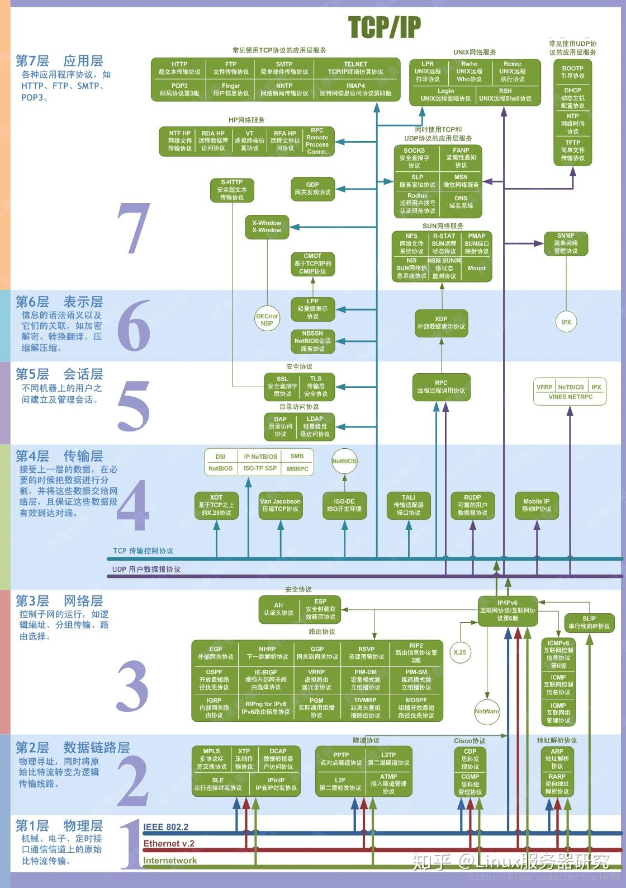

# 一、计网概述


## 互联网的组成
### 边缘部分
```
客户，服务器模式， 对等连接
```
### 核心部分

三种交换方式
```
电路交换： 电路连接 端到端，独占性大量占用资源
报文交换： 无连接
分组交换： 无连接 路由器用这种实现
```

核心交换方式
**存储转发，分组交换**
将整个报文数据段分为多个分组，每个组前面加上含必要信息的首部，从而进行交换
所以能做到负载均衡
分组交换中A-B-C-D之间任一部分，传输会占用这部分（如B-C）的全部带宽，不能分一点占用
但是带宽是动态分配的，给你多少带宽你就用里面的所有带宽

## 互联网性能（7个）
### 1.速率
数据的传输速率/数据率： bit/s
### 2.带宽
```
1.信号频带宽度
2.传输数据的能力 bit/s
```
### 3.吞吐量
单位时间通过某个网络的实际数据量
### 4.时延
定义：数据从网络一端到另一端的所需时间
分类
```
发送时延/传输时延：数据从主机到路由器的时间 = 数据帧长度(bit) / 发送速率(bit/s)
传播时延：电磁波在信道传播一定距离所需的时间 = 信道长度(m) / 传播速率(m/s)
处理时延：主机或路由器收到分组后所需的处理时间
排队时延：数据到路由器后排队等待转发所需的时间
```
总时延 = 发送时延 + 传播时延 + 处理时延 + 排队时延
### 5.时延宽带积
表明一条管道中有多少数据(bit)
时延宽带积 = 传播时延 x 带宽 (类比：路程=时间x速度)
### 6.往返时间RTT

A全部发完后，开始等（RTT开始），等接收到B所有数据时才结束（RTT结束）

发送时间 = 发送时延
发送时间 + RTT = 发送时延 + A最后一个数据发出到B接收到最后一个数据
有效数据率 = 数据长度 / (发送时间 + RTT)

### 7.利用率
分为信道利用率和网络利用率两种
**信道利用率**：信道有百分之几的时间被利用的
不是越高越好，利用率增加，数据一大所需的时延也迅速增加
**网络利用率**：30%左右
同样不是越高越好，太高所产生的时延可能指数级增大
## 协议

**体系结构 = 层 + 协议的结合（重点）**

### 七层OSI
```
应用层                   报文                      进程之间通信
表示层（4/5层中的应用层）
会话层（4/5层中的应用层）
传输层                   TCP报文段   UDP数据报      不同主机 进程之间通信
网络层                   分组/数据报                不同主机通信(可能在不同子网)
数据链路层                帧                       负责在物理媒介上传输比特流
物理层                   bit                      负责在物理媒介上传输比特流
```
> tip: 分组是笼统的概念，哪一层都可以这么说

**服务是垂直的、协议是水平的**



### 四层TCP/IP
```
应用层
传输层
网络层
物理链路层
```
### 网络协议组成
语法 类似P136的IP数据报
语义 类似数据报里的东西，如版本是IPV4/IPV6才有语义，IPV8无语义
同步(时序)
网络协议实质：计算机之间通信所使用的一种语言

### 划分层次
不同功能模块划分成不同层次
**网络体系结构 = 各层 + 层上协议 的集合**
P33 H3部分的数据 = P136 前面6行
P33 H2 T2  =  P81 PPP帧的首部和尾部
P33 中间小横线是虚传输，通过网络协议来完成，实际传输是箭头部分